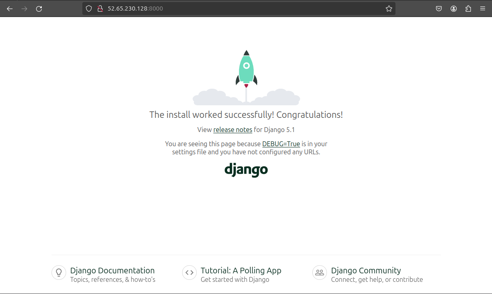
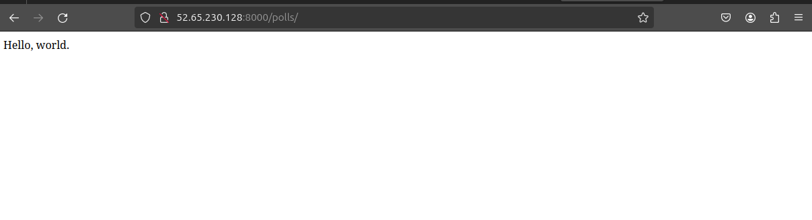
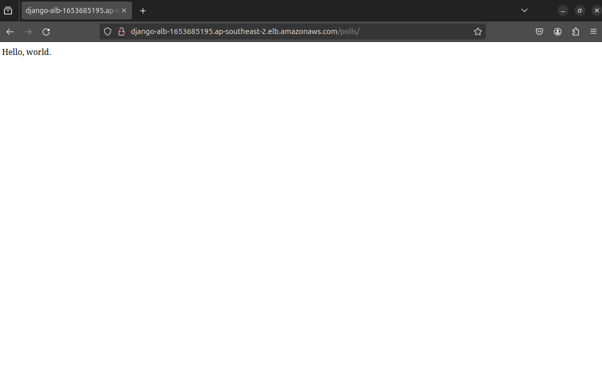
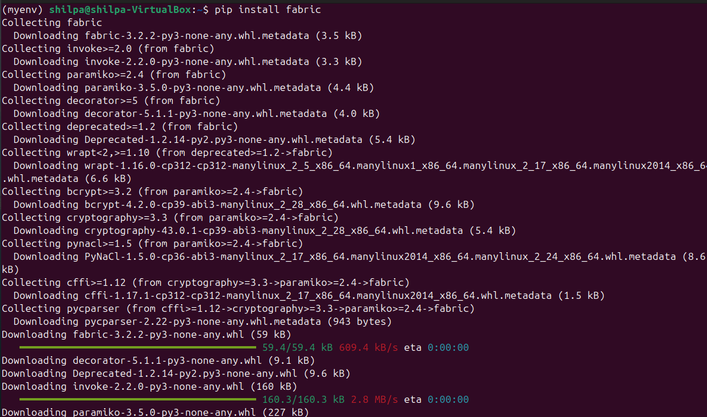
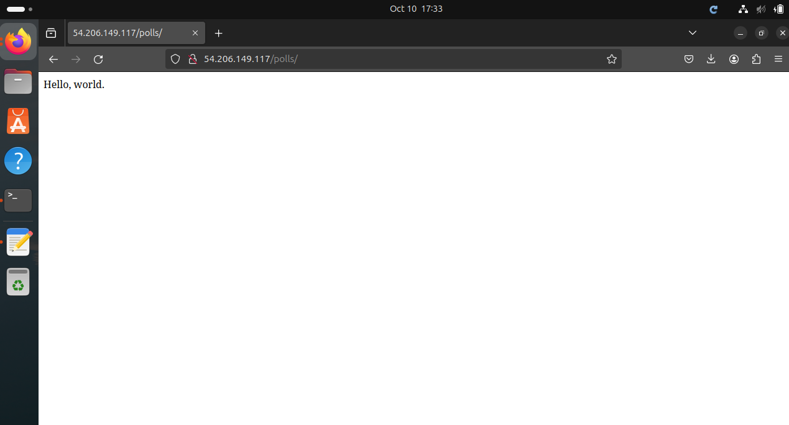
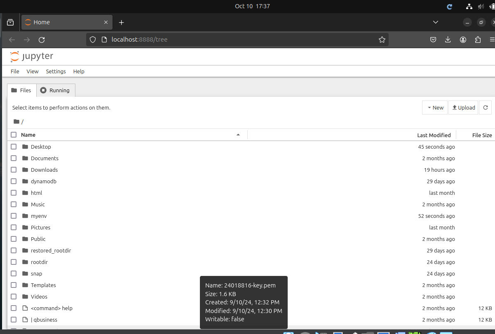
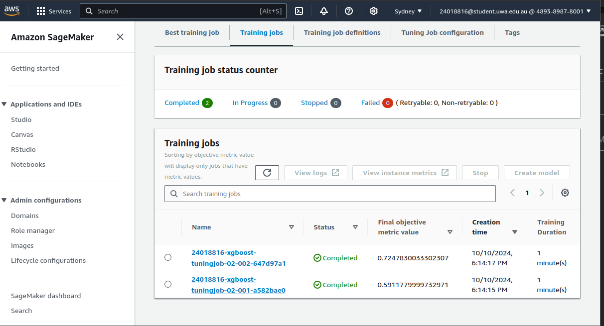
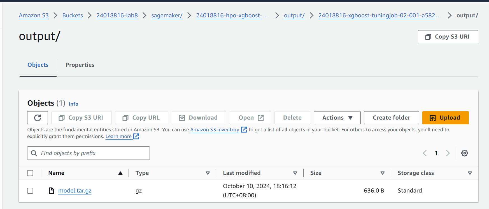
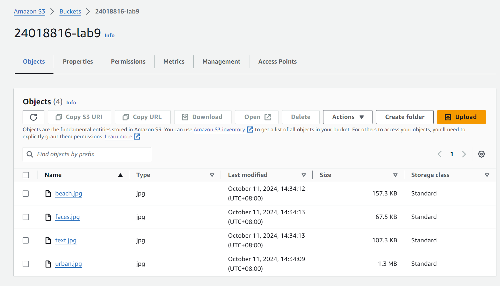



  <h2 style="text-align: center;">Labs 6-9</h2>
  
Student ID: 24018816

  
Student Name: Shilpa Sandhya

<h1 style="text-align: left;">Lab 6</h1>

<h2 style="text-align: left;">Set up an EC2 instance</h2>

<h3 style="text-align: left;">[1] Create an EC2 micro instance with Ubuntu and SSH into it.</h3>

  <h2>Command 1:</h2>
  
<strong>Use:</strong> This command creates a security group in the specified AWS EC2 environment.

  <pre><code>aws ec2 create-security-group --group-name 24018816-sg --description "security group for development environment"</code></pre>

  <h2>Explanation of Flags:</h2>
  <ul>
    <li><code>--group-name</code>: Specifies the name of the security group. Here, it is named <code>24018816-sg</code>.</li>
    <li><code>--description</code>: Provides a description for the security group.</li>
  </ul>

  <h2>Result:</h2>
  <pre><code>
{
    "GroupId": "sg-0acda99807c2d029f"
}
  </code></pre>

  <h2>Command 2:</h2>
  
<strong>Use:</strong> This command authorizes SSH access (port 22) for all incoming IPs in the specified security group.

  <pre><code>aws ec2 authorize-security-group-ingress --group-name 24018816-sg --protocol tcp --port 22 --cidr 0.0.0.0/0</code></pre>

  <h2>Explanation of Flags:</h2>
  <ul>
    <li><code>--group-name</code>: Specifies the name of the security group.</li>
    <li><code>--protocol</code>: The protocol for the rule, in this case, <code>tcp</code> for SSH.</li>
    <li><code>--port</code>: The port number to allow, in this case, port <code>22</code>, which is used for SSH.</li>
    <li><code>--cidr</code>: Specifies the CIDR range to allow access from. <code>0.0.0.0/0</code> allows access from anywhere.</li>
  </ul>

  <h2>Result:</h2>
  <pre><code>{
    "Return": true,
    "SecurityGroupRules": [
        {
            "SecurityGroupRuleId": "sgr-0115033329ffdb7ad",
            "GroupId": "sg-0acda99807c2d029f",
            "GroupOwnerId": "489389878001",
            "IsEgress": false,
            "IpProtocol": "tcp",
            "FromPort": 22,
            "ToPort": 22,
            "CidrIpv4": "0.0.0.0/0"
        }
    ]
}</code></pre>

  <h2>Command 3:</h2>
  
<strong>Use:</strong> This command creates a new key pair and saves the private key to a file for SSH access to an EC2 instance.

  <pre><code>aws ec2 create-key-pair --key-name 24018816lab6-key --query 'KeyMaterial' --output text > 24018816lab6-key.pem</code></pre>

  <h2>Explanation of Flags:</h2>
  <ul>
    <li><code>--key-name</code>: Specifies the name of the key pair to create, in this case, <code>24018816lab6-key</code>.</li>
    <li><code>--query 'KeyMaterial'</code>: Extracts the private key material from the response.</li>
    <li><code>--output text</code>: Outputs the private key material in plain text format.</li>
    <li><code>> 24018816lab6-key.pem</code>: Redirects the output to a file named <code>24018816lab6-key.pem</code>.</li>
  </ul>

  <h2>Command 4:</h2>
  
<strong>Use:</strong> This command changes the permissions of the key file to ensure it is secure for SSH usage.

  <pre><code>chmod 400 24018816lab6-key.pem</code></pre>

  <h2>Explanation of Flags:</h2>
  <ul>
    <li><code>chmod 400</code>: Changes the file permissions to read-only for the owner. This is necessary to securely use the key file.</li>
    <li><code>24018816lab6-key.pem</code>: The name of the file whose permissions are being changed.</li>
  </ul>

  <h2>Command 5:</h2>
  
<strong>Use:</strong> This command launches a new EC2 instance using a specific AMI, security group, and key pair.

  <pre><code>aws ec2 run-instances --image-id ami-0375ab65ee943a2a6 --security-group-ids 24018816-sg --count 1 --instance-type t2.micro --key-name 24018816lab6-key --query 'Instances[0].InstanceId'</code></pre>

  <h2>Explanation of Flags:</h2>
  <ul>
    <li><code>--image-id</code>: Specifies the Amazon Machine Image (AMI) ID to use for the instance. In this case, <code>ami-0375ab65ee943a2a6</code> is used.</li>
    <li><code>--security-group-ids</code>: Specifies the security group(s) to associate with the instance. Here, it is <code>24018816-sg</code>.</li>
    <li><code>--count</code>: Specifies the number of instances to launch. In this case, <code>1</code> instance is launched.</li>
    <li><code>--instance-type</code>: Specifies the instance type. Here, <code>t2.micro</code> is used, which is a low-cost, general-Use instance type.</li>
    <li><code>--key-name</code>: Specifies the key pair to use for SSH access to the instance. Here, it is <code>24018816lab6-key</code>.</li>
    <li><code>--query 'Instances[0].InstanceId'</code>: Filters the output to only return the ID of the newly created instance.</li>
  </ul>

  <h2>Result:</h2>
  <pre><code>
"i-0f2798f1db7781895"
  </code></pre>

  <h2>Command 6:</h2>
  
<strong>Use:</strong> This command applies a name tag to the newly created EC2 instance for easier identification.

  <pre><code>aws ec2 create-tags --resources i-0f2798f1db7781895 --tags Key=Name,Value=24018816-vm6</code></pre>

  <h2>Explanation of Flags:</h2>
  <ul>
    <li><code>--resources</code>: Specifies the instance to tag. In this case, the instance ID is <code>i-0f2798f1db7781895</code>.</li>
    <li><code>--tags</code>: Specifies the key-value pairs for the tags. In this case, the key is <code>Name</code>, and the value is <code>24018816-vm6</code>.</li>
  </ul>

  <h2>Command 7:</h2>
  
<strong>Use:</strong> This command retrieves the public IP address of the specified EC2 instance.

  <pre><code>aws ec2 describe-instances --instance-ids i-0f2798f1db7781895 --query 'Reservations[0].Instances[0].PublicIpAddress'</code></pre>

  <h2>Explanation of Flags:</h2>
  <ul>
    <li><code>--instance-ids</code>: Specifies the instance ID to retrieve information for. In this case, it is <code>i-0f2798f1db7781895</code>.</li>
    <li><code>--query 'Reservations[0].Instances[0].PublicIpAddress'</code>: Filters the output to only return the public IP address of the instance.</li>
  </ul>

  <h2>Result:</h2>
  <pre><code>
"52.65.230.128"
  </code></pre>

<h3 style="text-align: left;">[2] Install the Python 3 virtual environment package. </h3>

  <h2>Command 1:</h2>
  
<strong>Use:</strong> This command updates the local package index to reflect the latest available package versions.

  <pre><code>sudo apt-get update</code></pre>

  <h2>Explanation of Flags:</h2>
  <ul>
    <li><code>sudo</code>: Runs the command with superuser (administrator) privileges.</li>
    <li><code>apt-get</code>: The command-line tool for handling packages in Ubuntu-based systems.</li>
    <li><code>update</code>: Fetches the latest version information about the packages from the repositories, but it doesn't install anything.</li>
  </ul>

  <h2>Command 2:</h2>
  
<strong>Use:</strong> This command upgrades all the installed packages to their latest versions based on the updated package index.

  <pre><code>sudo apt-get upgrade</code></pre>

  <h2>Explanation of Flags:</h2>
  <ul>
    <li><code>upgrade</code>: Installs the latest versions of all installed packages that have updates available.</li>
  </ul>

  <h2>Command 3:</h2>
  
<strong>Use:</strong> This command installs the Python virtual environment module, allowing to create isolated Python environments.

  <pre><code>sudo apt-get install python3-venv</code></pre>

  <h2>Explanation of Flags:</h2>
  <ul>
    <li><code>python3-venv</code>: The specific package that provides the Python virtual environment functionality for Python 3.</li>
  </ul>

  <h2>Command 4:</h2>
  
<strong>Use:</strong> This command starts a new shell session with superuser privileges, making it easier to run subsequent commands as root.

  <pre><code>sudo bash</code></pre>

  <h2>Explanation of Flags:</h2>
  <ul>
    <li><code>bash</code>: Launches the Bash shell, a popular command-line interpreter.</li>
  </ul>

<h3 style="text-align: left;">[3] Access a directory </h3>

  <h2>Command 1:</h2>
  <pre><code>cd /opt/</code></pre>

  <h2>Explanation of Flags:</h2>
  <ul>
    <li><code>cd</code>: The command to change the current working directory.</li>
    <li><code>/opt/</code>: The directory path where you want to navigate.</li>
  </ul>

  <h2>Result:</h2>
  <pre><code>The shell’s current working directory is changed to <code>/opt/</code>.</code></pre>

  <h2>Command 2:</h2>
  <pre><code>mkdir wwc</code></pre>

  <h2>Explanation of Flags:</h2>
  <ul>
    <li><code>mkdir</code>: The command to create directories.</li>
    <li><code>wwc</code>: The name of the directory being created in the current path <code>/opt/</code>.</li>
  </ul>

  <h2>Result:</h2>
  <pre><code>A new directory <code>wwc</code> is created inside <code>/opt/</code>.</code></pre>

  <h2>Command 3:</h2>
  <pre><code>cd wwc/</code></pre>

  <h2>Result:</h2>
  <pre><code>The shell’s current working directory is changed to <code>/opt/wwc/</code>.</code></pre>

  <h2>Command 4:</h2>
  
<strong>Use:</strong> This command creates a new directory named <code>mysites</code> inside the <code>/opt/wwc/</code> directory.

  <pre><code>mkdir mysites</code></pre>

  <h2>Explanation of Flags:</h2>
  <ul>
    <li><code>mysites</code>: The name of the directory being created inside the current directory <code>/opt/wwc/</code>.</li>
  </ul>

  <h2>Result:</h2>
  <pre><code>A new directory <code>mysites</code> is created inside <code>/opt/wwc/</code>.</code></pre>

  <h2>Command 5:</h2>
  
<strong>Use:</strong> This command changes the current working directory to <code>/opt/wwc/mysites/</code>, which was just created.

  <pre><code>cd mysites/</code></pre>

  <h2>Result:</h2>
  <pre><code>The shell’s current working directory is changed to <code>/opt/wwc/mysites/</code>.</code></pre>

<h3 style="text-align: left;">[4] Set up a virtual environment</h3>

  <h2>Command:</h2>
  
<strong>Use:</strong> This command creates a virtual environment named <code>myvenv</code> using Python 3's built-in <code>venv</code> module.

  <pre><code>python3 -m venv myvenv</code></pre>

  <h2>Explanation of Flags:</h2>
  <ul>
    <li><code>python3</code>: Specifies that the command should use Python 3.</li>
    <li><code>-m</code>: Runs the specified Python module as a script. In this case, it runs the <code>venv</code> module to create a virtual environment.</li>
    <li><code>venv</code>: The Python module that is used to create virtual environments. It allows for isolated Python environments to manage dependencies separately.</li>
    <li><code>myvenv</code>: The name of the directory where the virtual environment will be created. </li>
  </ul>

<h3 style="text-align: left;">[5] Activate the virtual environment</h3>

  <h2>Command 1:</h2>
  
<strong>Use:</strong> This command activates the virtual environment created in the previous steps.

  <pre><code>source myvenv/bin/activate</code></pre>

  <h2>Explanation of Flags:</h2>
  <ul>
    <li><code>source</code>: A shell built-in command that runs the script located at the given path in the current shell. In this case, it activates the Python virtual environment.</li>
    <li><code>myvenv/bin/activate</code>: The path to the virtual environment activation script.</li>
  </ul>

  <h2>Command 2:</h2>
  
<strong>Use:</strong> This command installs Django, a popular Python web framework, in the virtual environment.

  <pre><code>pip install django</code></pre>

  <h2>Explanation of Flags:</h2>
  <ul>
    <li><code>pip</code>: The package manager for Python, used to install Python packages from the Python Package Index (PyPI).</li>
    <li><code>django</code>: The name of the package being installed. In this case, Django is the Python framework being installed.</li>
  </ul>

  <h2>Command 3:</h2>
  <pre><code>django-admin startproject lab</code></pre>

  <h2>Explanation of Flags:</h2>
  <ul>
    <li><code>django-admin</code>: The command-line utility for administrative tasks in Django.</li>
    <li><code>startproject</code>: A command to create a new Django project structure, including necessary files and settings.</li>
    <li><code>lab</code>: The name of the Django project being created.</li>
  </ul>

  <h2>Command 4:</h2>
  <pre><code>cd lab/</code></pre>

  <h2>Result:</h2>
  <pre><code>The working directory is changed to <code>lab/</code>.</code></pre>

  <h2>Command 5:</h2>
  
<strong>Use:</strong> This command creates a new Django app named <code>polls</code> inside the <code>lab</code> project.

  <pre><code>python3 manage.py startapp polls</code></pre>

  <h2>Explanation of Flags:</h2>
  <ul>
    <li><code>python3</code>: Specifies that Python 3 is being used to run the Django management script.</li>
    <li><code>manage.py</code>: A command-line utility provided by Django for administrative tasks in a Django project.</li>
    <li><code>startapp</code>: The command used to create a new Django application within the project.</li>
    <li><code>polls</code>: The name of the app being created within the project.</li>
  </ul>

<h3 style="text-align: left;">[6] Install nginx</h3>

  <h2>Command:</h2>
  <pre><code>apt install nginx</code></pre>

  <h2>Explanation of Flags:</h2>
  <ul>
    <li><code>nginx</code>: The name of the package to be installed. Nginx is a high-performance HTTP server and reverse proxy.</li>
  </ul>

<h3 style="text-align: left;">[7] Configure nginx</h3>

  <h2>Task:</h2>
  
<strong>Use:</strong> The Nginx configuration file <code>/etc/nginx/sites-enabled/default</code> to set up reverse proxying for a web application running on <code>http://127.0.0.1:8000</code>.

  <h2>Command 1:</h2>
  <pre><code>vi /etc/nginx/sites-enabled/default</code></pre>

  <h2>Explanation of Flags:</h2>
  <ul>
    <li><code>vi</code>: Opens the specified file in the <code>vi</code> text editor, a commonly used command-line editor for Unix/Linux systems.</li>
    <li><code>/etc/nginx/sites-enabled/default</code>: This file contains the default server configuration for Nginx.</li>
  </ul>

  <h2>Result:</h2>
  
Printing the updated file.

  <pre><code>
server {
  listen 80 default_server;
  listen [::]:80 default_server;

  location / {
    proxy_set_header X-Forwarded-Host $host;
    proxy_set_header X-Real-IP $remote_addr;
    proxy_pass http://127.0.0.1:8000;
  }
}
  </code></pre>
  <h2>Explanation:</h2>
  <ul>
    <li><code>listen 80 default_server;</code>: Configures Nginx to listen on port 80, the default HTTP port, for incoming requests.</li>
    <li><code>location /</code>: Specifies the root path <code>/</code> of the server block, meaning this configuration applies to all requests to the server.</li>
    <li><code>proxy_set_header X-Forwarded-Host $host;</code>: Sets the <code>X-Forwarded-Host</code> header to the value of the host header from the client request.</li>
    <li><code>proxy_set_header X-Real-IP $remote_addr;</code>: Sets the <code>X-Real-IP</code> header to the IP address of the client making the request.</li>
    <li><code>proxy_pass http://127.0.0.1:8000;</code>: Forwards the client request to the web application running on <code>http://127.0.0.1:8000</code> (typically a Django app).</li>
  </ul>

<h3 style="text-align: left;">Restart nginx</h3>

  <h2>Command:</h2>
  
<strong>Use:</strong> This command restarts the Nginx service, applying any changes made to its configuration files.

  <pre><code>service nginx restart</code></pre>

  <h2>Explanation of Flags:</h2>
  <ul>
    <li><code>service</code>: A command used to manage system services on Linux. It can start, stop, restart, or check the status of services.</li>
    <li><code>nginx</code>: Specifies the service that is being managed. In this case, it refers to the Nginx web server.</li>
    <li><code>restart</code>: This action stops the Nginx service and then starts it again. </li>
  </ul>

<h3 style="text-align: left;">Access your EC2 instance</h3>

  <h2>Command:</h2>
  
<strong>Use:</strong> This command starts the Django development server on port 8000, allowing to view and interact with the Django application through a web browser.

  <pre><code>python3 manage.py runserver 8000</code></pre>

  <h2>Explanation of Flags:</h2>
  <ul>
    <li><code>manage.py</code>: A Django-provided command-line utility for administrative tasks related to the Django project.</li>
    <li><code>runserver</code>: Starts the built-in Django development server. This is meant for local development and debugging.</li>
    <li><code>8000</code>: Specifies the port number on which the Django server will listen for incoming HTTP requests. By default, Django uses port 8000.</li>
  </ul>

  <h2>Result:</h2>
  <pre><code>
The Django development server starts, and the application is accessible by opening a web browser and navigating to the public IP address of EC2 instance with port 8000 (e.g., <code>http://52.65.230.128:8000</code>).
  </code></pre>

  <h2>Browser Output:</h2>
  
The screenshot below shows the browser output:

  

<h2 style="text-align: left;">Set up Django inside the created EC2 instance</h2>

<h3 style="text-align: left;">[1] Edit the following files (create them if not exist)</h3>

  <h2>Editing <code>polls/views.py</code>:</h2>
  
<strong>Use:</strong> This file defines the logic for rendering a response when a request is made to the <code>polls</code> app. The function <code>index</code> is defined to return a simple "Hello, world." message.

  
  <h3>Code:</h3>
  <pre><code>from django.http import HttpResponse

def index(request):
    return HttpResponse("Hello, world.")</code></pre>

  <h3>Explanation:</h3>
  <ul>
    <li><code>from django.http import HttpResponse</code>: Imports the <code>HttpResponse</code> class, which is used to send a simple string response back to the client.</li>
    <li><code>def index(request)</code>: Defines a view function named <code>index</code>, which takes the incoming HTTP request as an argument.</li>
    <li><code>return HttpResponse("Hello, world.")</code>: This line returns an HTTP response with the content "Hello, world." when the view is called.</li>
  </ul>

  <h2>Editing <code>polls/urls.py</code>:</h2>
  
<strong>Use:</strong> This file maps the <code>polls</code> app URLs to their respective views. In this case, it maps the root URL of the <code>polls</code> app to the <code>index</code> view defined in <code>polls/views.py</code>.

  <h3>Code:</h3>
  <pre><code>from django.urls import path
from . import views

urlpatterns = [
    path('', views.index, name='index'),
]</code></pre>

  <h3>Explanation:</h3>
  <ul>
    <li><code>from django.urls import path</code>: Imports the <code>path</code> function to define URL patterns.</li>
    <li><code>from . import views</code>: Imports the <code>views</code> module from the current directory, where the <code>index</code> view is defined.</li>
    <li><code>path('', views.index, name='index')</code>: Maps the root URL of the <code>polls</code> app (<code>''</code>) to the <code>index</code> view. When users visit <code>/polls/</code>, the <code>index</code> view will be executed.</li>
  </ul>

  <h2>Editing <code>lab/urls.py</code>:</h2>
  
<strong>Use:</strong> This file defines the main URL routing for the entire Django project. It includes the URLs for the <code>polls</code> app and the Django admin interface.

  <h3>Code:</h3>
  <pre><code>from django.urls import include, path
from django.contrib import admin

urlpatterns = [
    path('polls/', include('polls.urls')),
    path('admin/', admin.site.urls),
]</code></pre>

  <h3>Explanation:</h3>
  <ul>
    <li><code>from django.contrib import admin</code>: Imports the Django admin module, which allows to manage the app via the Django admin interface.</li>
    <li><code>path('polls/', include('polls.urls'))</code>: Maps the URL <code>/polls/</code> to the URL configuration in <code>polls/urls.py</code>, making the <code>polls</code> app accessible at <code>/polls/</code>.</li>
    <li><code>path('admin/', admin.site.urls)</code>: Maps the URL <code>/admin/</code> to the Django admin interface, enabling access to the admin dashboard.</li>
  </ul>

<h3 style="text-align: left;">[2] Run the web server again</h3>

  <h2>Command:</h2>
  
<strong>Use:</strong> This command starts the Django development server on port 8000, allowing you to view and interact with your Django application through a web browser.

  <pre><code>python3 manage.py runserver 8000</code></pre>

<h3 style="text-align: left;">[3] Access the EC2 instance</h3>

  <h2>Browser Output:</h2>
  
After running the command and opening the browser at <code>http://52.65.230.128:8000/polls/</code>, the result is:

  <pre><code>Hello, world.</code></pre>

  <h2>Screenshot:</h2>
  
The screenshot below shows the browser output:

  

<h2 style="text-align: left;"> Set up an ALB</h2>

<h3 style="text-align: left;">[1] Create an application load balancer</h3>

  <h2>Command 1: Create Security Group</h2>
  
<strong>Use:</strong> Create a security group named <code>24018816alb-sg</code> for the application load balancer (ALB).

  <pre><code>aws ec2 create-security-group --group-name 24018816alb-sg --description "Security group for ALB" --vpc-id vpc-02b6e802531f92452</code></pre>
  <h3>Explanation of Flags:</h3>
  <ul>
    <li><code>--group-name</code>: Name of the security group.</li>
    <li><code>--description</code>: A brief description of the security group.</li>
    <li><code>--vpc-id</code>: ID of the VPC where the security group will be created.</li>
  </ul>
  <h3>Result:</h3>
  <pre><code>{
    "GroupId": "sg-0218fa9d88972208d"
  }</code></pre>

  <h2>Command 2: Authorize Security Group Ingress</h2>
  
<strong>Use:</strong> Allows HTTP traffic on port 80 through the security group.

  <pre><code>aws ec2 authorize-security-group-ingress --group-id sg-0218fa9d88972208d --protocol tcp --port 80 --cidr 0.0.0.0/0</code></pre>
  <h3>Explanation of Flags:</h3>
  <ul>
    <li><code>--group-id</code>: ID of the security group.</li>
    <li><code>--protocol</code>: The protocol to allow (e.g., <code>tcp</code>).</li>
    <li><code>--cidr</code>: CIDR block to allow access from (e.g., <code>0.0.0.0/0</code>).</li>
  </ul>
  <h3>Result:</h3>
  <pre><code>{
    "Return": true,
    "SecurityGroupRules": [
        {
            "SecurityGroupRuleId": "sgr-0e1fd6bde1033f694",
            "GroupId": "sg-0218fa9d88972208d",
            "IpProtocol": "tcp",
            "FromPort": 80,
            "ToPort": 80,
            "CidrIpv4": "0.0.0.0/0"
        }
    ]
  }</code></pre>

  <h2>Command 3: Create Application Load Balancer</h2>
  
<strong>Use:</strong> Create an ALB named <code>django-alb</code> in the specified subnets and attach the security group.

  <pre><code>aws elbv2 create-load-balancer --name django-alb --subnets subnet-0ea51d9f3c8c2f2cd subnet-00b6fbbd5e710eba9 --security-groups sg-0218fa9d88972208d</code></pre>
  <h3>Explanation of Flags:</h3>
  <ul>
    <li><code>--name</code>: Name of the load balancer.</li>
    <li><code>--subnets</code>: IDs of the subnets where the ALB will be placed.</li>
    <li><code>--security-groups</code>: ID of the security group attached to the ALB.</li>
  </ul>
  <h3>Result:</h3>
  <pre><code>{
    "LoadBalancers": [
        {
            "LoadBalancerArn": "arn:aws:elasticloadbalancing:ap-southeast-2:489389878001:loadbalancer/app/django-alb/f17565dedf6de9f6",
            "DNSName": "django-alb-1653685195.ap-southeast-2.elb.amazonaws.com"
        }
    ]
  }</code></pre>

  <h2>Command 4: Create Target Group</h2>
  
<strong>Use:</strong> Create a target group to forward traffic to the registered EC2 instance.

  <pre><code>aws elbv2 create-target-group --name django-tg --protocol HTTP --port 80 --vpc-id vpc-02b6e802531f92452 --health-check-path /polls/ --health-check-interval-seconds 30</code></pre>
  <h3>Explanation of Flags:</h3>
  <ul>
    <li><code>--name</code>: Name of the target group.</li>
    <li><code>--vpc-id</code>: ID of the VPC for the target group.</li>
    <li><code>--health-check-path</code>: Path to use for health checks.</li>
    <li><code>--health-check-interval-seconds</code>: Interval between health checks.</li>
  </ul>

  <h2>Command 5: Register EC2 Instance as a Target</h2>
  
<strong>Use:</strong> Register an EC2 instance as a target in the target group.

  <pre><code>aws elbv2 register-targets --target-group-arn arn:aws:elasticloadbalancing:ap-southeast-2:489389878001:targetgroup/django-tg/750dbb6e16de399d --targets Id=i-0f2798f1db7781895</code></pre>
  <h3>Explanation of Flags:</h3>
  <ul>
    <li><code>--target-group-arn</code>: ARN of the target group.</li>
    <li><code>--targets</code>: ID of the EC2 instance to register.</li>
  </ul>

  <h2>Command 6: Create Listener on the ALB</h2>
  
<strong>Use:</strong> Create a listener on the ALB to forward HTTP traffic to the target group.

  <pre><code>aws elbv2 create-listener --load-balancer-arn arn:aws:elasticloadbalancing:ap-southeast-2:489389878001:loadbalancer/app/django-alb/f17565dedf6de9f6 --protocol HTTP --port 80 --default-actions Type=forward,TargetGroupArn=arn:aws:elasticloadbalancing:ap-southeast-2:489389878001:targetgroup/django-tg/750dbb6e16de399d</code></pre>
  <h3>Explanation of Flags:</h3>
  <ul>
    <li><code>--load-balancer-arn</code>: ARN of the ALB.</li>
    <li><code>--protocol</code>: Protocol for the listener (e.g., HTTP).</li>
    <li><code>--port</code>: Port number for the listener.</li>
    <li><code>--default-actions</code>: Actions to take when traffic is received.</li>
  </ul>

  <h2>Command 7: Describe Load Balancer</h2>
  
<strong>Use:</strong> Verify the status and DNS name of the ALB.

  <pre><code>aws elbv2 describe-load-balancers --names django-alb</code></pre>
  <h3>Result:</h3>
  <pre><code>{
    "LoadBalancers": [
        {
            "DNSName": "django-alb-1653685195.ap-southeast-2.elb.amazonaws.com",
            "State": {
                "Code": "active"
            }
        }
    ]
  }</code></pre>

<h3 style="text-align: left;">[2] Health check</h3>

  <h2>Command: Create Target Group with Health Check</h2>
  
<strong>Use:</strong> Create a target group named <code>django-tg</code> that performs health checks on the <code>/polls/</code> path every 30 seconds.

  <pre><code>
aws elbv2 create-target-group \
  --name django-tg \
  --protocol HTTP \
  --port 80 \
  --vpc-id vpc-02b6e802531f92452 \
  --health-check-protocol HTTP \
  --health-check-port traffic-port \
  --health-check-path /polls/ \
  --health-check-interval-seconds 30 \
  --health-check-timeout-seconds 5 \
  --healthy-threshold-count 5 \
  --unhealthy-threshold-count 2
  </code></pre>

  <h3>Explanation of Flags:</h3>
  <ul>
    <li><code>--health-check-protocol</code>: Protocol used for the health check (HTTP).</li>
    <li><code>--health-check-port</code>: Port for health checks. <code>traffic-port</code> means it will use the target group’s port.</li>
    <li><code>--health-check-path</code>: Path used for health check requests (<code>/polls/</code>).</li>
    <li><code>--health-check-interval-seconds</code>: Interval between health checks (30 seconds).</li>
    <li><code>--health-check-timeout-seconds</code>: Timeout period for a health check response (5 seconds).</li>
    <li><code>--healthy-threshold-count</code>: Number of consecutive successful checks before marking a target as healthy (5).</li>
    <li><code>--unhealthy-threshold-count</code>: Number of consecutive failed checks before marking a target as unhealthy (2).</li>
  </ul>

  <h3>Result:</h3>
  <pre><code>
{
    "TargetGroups": [
        {
            "TargetGroupArn": "arn:aws:elasticloadbalancing:ap-southeast-2:489389878001:targetgroup/django-tg/750dbb6e16de399d",
            "TargetGroupName": "django-tg",
            "Protocol": "HTTP",
            "Port": 80,
            "VpcId": "vpc-02b6e802531f92452",
            "HealthCheckProtocol": "HTTP",
            "HealthCheckPort": "traffic-port",
            "HealthCheckPath": "/polls/",
            "HealthCheckIntervalSeconds": 30,
            "HealthCheckTimeoutSeconds": 5,
            "HealthyThresholdCount": 5,
            "UnhealthyThresholdCount": 2,
            "Matcher": {
                "HttpCode": "200"
            }
        }
    ]
}
  </code></pre>

<h3 style="text-align: left;">[3] Access</h3>

  <h2>Accessing the ALB URL</h2>
  
<strong>URL:</strong>

  <pre><code>http://django-alb-1653685195.ap-southeast-2.elb.amazonaws.com/polls/</code></pre>

  <h3>Result:</h3>
  
The following content was displayed on accessing the /polls/ route:

  <pre><code>Hello, world.</code></pre>

  <h4>Screenshot:</h4>
  
  
  <h3>Cleanup:</h3>
  
After verifying the setup, I have deleted the EC2 instance and the ALB to free up resources through aws console.

<h1 style="text-align: left;">Lab 7</h1>

<h3 style="text-align: left;">[1] Create an EC2 instance</h3>

  <h3>1. Create Security Group</h3>
  <pre><code>
aws ec2 create-security-group \
  --group-name 24018816-lab7a-sg \
  --description "security group for development environment"
  </code></pre>

  <h3>Explanation of Flags:</h3>
  <ul>
    <li><code>--group-name</code>: The name of the security group (24018816-lab7a-sg).</li>
    <li><code>--description</code>: Description of the purpose of the security group.</li>
  </ul>

  <h3>Result:</h3>
  <pre><code>
{
    "GroupId": "sg-05bdeffa6376c476b"
}
  </code></pre>

  <h3>2. Authorize Inbound SSH Access</h3>
  <pre><code>
aws ec2 authorize-security-group-ingress \
  --group-name 24018816-lab7a-sg \
  --protocol tcp \
  --port 22 \
  --cidr 0.0.0.0/0
  </code></pre>

  <h3>Explanation of Flags:</h3>
  <ul>
    <li><code>--group-name</code>: Specifies the security group name (24018816-lab7a-sg).</li>
    <li><code>--protocol</code>: Protocol used for the rule (TCP).</li>
    <li><code>--port</code>: Port to allow access on (22 for SSH).</li>
    <li><code>--cidr</code>: Specifies IP range to allow access from (0.0.0.0/0 means all IPs).</li>
  </ul>

  <h3>Result:</h3>
  <pre><code>
{
    "Return": true,
    "SecurityGroupRules": [
        {
            "SecurityGroupRuleId": "sgr-0d37058958b332477",
            "GroupId": "sg-05bdeffa6376c476b",
            "IpProtocol": "tcp",
            "FromPort": 22,
            "ToPort": 22,
            "CidrIpv4": "0.0.0.0/0"
        }
    ]
}
  </code></pre>

  <h3>3. Create Key Pair</h3>
  <pre><code>
aws ec2 create-key-pair \
  --key-name 24018816-lab7a-key \
  --query 'KeyMaterial' --output text > 24018816-lab7a-key.pem
chmod 400 24018816-lab7a-key.pem
  </code></pre>

  <h3>Explanation:</h3>
  <ul>
    <li><code>--key-name</code>: Name of the key pair (24018816-lab7a-key).</li>
    <li><code>--query</code>: Filters the response to show only the key material.</li>
    <li><code>--output text</code>: Outputs the key in plain text format.</li>
    <li><code>chmod 400</code>: Sets read-only permissions on the private key.</li>
  </ul>

  <h3>4. Launch EC2 Instance</h3>
  <pre><code>
aws ec2 run-instances \
  --image-id ami-0375ab65ee943a2a6 \
  --security-group-ids sg-05bdeffa6376c476b \
  --count 1 \
  --instance-type t2.micro \
  --key-name 24018816-lab7a-key \
  --query 'Instances[0].InstanceId'
  </code></pre>

  <h3>Explanation of Flags:</h3>
  <ul>
    <li><code>--image-id</code>: AMI ID to use for the instance (ami-0375ab65ee943a2a6).</li>
    <li><code>--security-group-ids</code>: Security group to attach (sg-05bdeffa6376c476b).</li>
    <li><code>--count</code>: Number of instances to launch (1).</li>
    <li><code>--instance-type</code>: Instance type (t2.micro).</li>
    <li><code>--key-name</code>: Key pair to use for SSH access.</li>
    <li><code>--query</code>: Returns only the instance ID.</li>
  </ul>

  <h3>Result:</h3>
  <pre><code>
"i-0898afaca5524de59"
  </code></pre>

  <h3>5. Tag the EC2 Instance</h3>
  <pre><code>
aws ec2 create-tags \
  --resources i-0898afaca5524de59 \
  --tags Key=Name,Value=24018816-lab7a-vm
  </code></pre>

  <h3>Explanation:</h3>
  <ul>
    <li><code>--resources</code>: Specifies the resource (instance) to tag.</li>
    <li><code>--tags</code>: Key-value pair to use as the tag (Name=24018816-lab7a-vm).</li>
  </ul>

  <h3>6. Retrieve Public IP Address</h3>
  <pre><code>
aws ec2 describe-instances \
  --instance-ids i-0898afaca5524de59 \
  --query 'Reservations[0].Instances[0].PublicIpAddress'
  </code></pre>

  <h3>Explanation of Flags:</h3>
  <ul>
    <li><code>--instance-ids</code>: ID of the instance to describe.</li>
    <li><code>--query</code>: Filters the output to show only the public IP address.</li>
  </ul>

  <h3>Result:</h3>
  <pre><code>
"54.206.149.117"
  </code></pre>

<h3 style="text-align: left;">[2] Install and configure Fabric</h3>

  
  <h3>1. Installing Fabric</h3>
  <pre><code>pip install fabric</code></pre>
  
  <h3>Explanation of flag:</h3>
  <ul>
    <li><code>fabric</code>: The name of the package being installed. Fabric is a Python library for streamlining the use of SSH for application deployment and automation.</li>

  </ul>

  <h3>Result:</h3>
  
Fabric and its dependencies are successfully installed:

  

  <h3>2. Configuring SSH for Fabric</h3>
  
Create a configuration file at <code>~/.ssh/config</code>:

  <pre><code>
Host 24018816-lab7a-vm
  Hostname ec2-54-206-149-117.ap-southeast-2.compute.amazonaws.com
  User ubuntu
  UserKnownHostsFile /dev/null
  StrictHostKeyChecking no
  PasswordAuthentication no
  IdentityFile /home/shilpa/24018816-lab7a-key.pem
  </code></pre>
  
  <h3>Explanation of flags:</h3>
  <ul>
    <li><code>Host</code>: Name used to reference this configuration.</li>
    <li><code>Hostname</code>: Public DNS name of the EC2 instance.</li>
    <li><code>User</code>: The default user for the EC2 instance (<code>ubuntu</code>).</li>
    <li><code>UserKnownHostsFile /dev/null</code>: Disables saving of the host key.</li>
    <li><code>StrictHostKeyChecking no</code>: Allows connections without host verification.</li>
    <li><code>PasswordAuthentication no</code>: Disables password authentication.</li>
    <li><code>IdentityFile</code>: Path to the private key for the EC2 instance.</li>
  </ul>

  <h3>3. Connecting to EC2 Using Fabric</h3>
  
  
  <h3>Explanation of Fabric Commands:</h3>
  

  <h3>Explanation of Flags:</h3>
  <ul>
    <li><code>from fabric import Connection</code>: Imports the <code>Connection</code> class from the Fabric library, which is used to create and manage SSH connections.</li>
    <li><code>c = Connection('24018816-lab7a-vm')</code>: 
      <ul>
        <li><code>Connection()</code>: Establishes an SSH connection to a host.</li>
        <li><code>'24018816-lab7a-vm'</code>: The alias of the remote host defined in <code>~/.ssh/config</code> file, which contains the hostname, user, and other SSH configuration details.</li>
      </ul>
    </li>
    <li><code>result = c.run('uname -s')</code>: 
      <ul>
        <li><code>c.run()</code>: Executes a shell command on the remote host over the SSH connection.</li>
        <li><code>'uname -s'</code>: A Linux command that returns the system's kernel name.</li>
      </ul>
    </li>
  </ul> 

<h3 style="text-align: left;">[3] Use Fabric for automation</h3>

  <h2>Automated Setup of Django App on EC2 Instance Using Fabric</h2>
  
<strong>Use:</strong> This Python script automates the setup of a Python virtual environment, installs Nginx and Django, configures a Django project, and runs it on the EC2 instance.

  <h3>Logic of the Code:</h3>
  
The script uses the <code>fabric</code> library to connect remotely to an EC2 instance via SSH. It performs several automated steps, such as updating and upgrading the system packages, installing required software (Python virtual environment and Nginx), setting up a Django application, and ensuring that the Nginx web server and Django development server are properly configured and running. 
  By following these steps, the code ensures that the Django app is accessible via the EC2 instance's public IP on port 8000. Additionally, any previous Django server processes are killed to avoid conflicts, and the server is run in the background using <code>nohup</code>.

  <pre><code>
from fabric import Connection
import time

EC2_HOST = "54.206.149.117"
PRIVATE_KEY_PATH = "/home/shilpa/24018816-lab7a-key.pem"

def deploy_django():
    # Connect to the EC2 instance
    c = Connection(
        host=EC2_HOST,
        user="ubuntu",
        connect_kwargs={"key_filename": PRIVATE_KEY_PATH}
    )

    # Update and upgrade packages
    c.sudo("apt-get update")
    c.sudo("apt-get upgrade -y")

    # Install required packages
    c.sudo("apt-get install -y python3-venv nginx")

    # Set up project directory
    c.sudo("mkdir -p /opt/wwc/mysites")
    c.sudo("chown ubuntu:ubuntu /opt/wwc/mysites")

    # Set up virtual environment
    with c.cd("/opt/wwc/mysites"):
        if c.run("test -d myvenv", warn=True).failed:
            c.run("python3 -m venv myvenv")
        c.run("source myvenv/bin/activate && pip install django")

    # Create Django project and app
    with c.cd("/opt/wwc/mysites"):
        if c.run("test -d lab", warn=True).failed:
            c.run("source myvenv/bin/activate && django-admin startproject lab")
        with c.cd("lab"):
            if c.run("test -d polls", warn=True).failed:
                c.run("source ../../myvenv/bin/activate && python manage.py startapp polls")

    # Configure Django files
    polls_views = '''
from django.http import HttpResponse

def index(request):
    return HttpResponse("Hello, world.")
'''
    c.run(f"cat << EOF > /opt/wwc/mysites/lab/polls/views.py\n{polls_views}\nEOF")

    polls_urls = '''
from django.urls import path
from . import views

urlpatterns = [
    path('', views.index, name='index'),
]
'''
    c.run(f"cat << EOF > /opt/wwc/mysites/lab/polls/urls.py\n{polls_urls}\nEOF")

    lab_urls = '''
from django.contrib import admin
from django.urls import include, path

urlpatterns = [
    path('polls/', include('polls.urls')),
    path('admin/', admin.site.urls),
]
'''
    c.run(f"cat << EOF > /opt/wwc/mysites/lab/lab/urls.py\n{lab_urls}\nEOF")

    # Check nginx configuration
    print("Checking nginx configuration...")
    result = c.sudo('nginx -t', warn=True)
    if result.failed:
        print("Nginx configuration test failed.")
    else:
        print("Nginx configuration test passed.")

    # Restart nginx
    c.sudo('systemctl restart nginx')

    # Start Django development server
    c.run('pkill -f "python manage.py runserver"', warn=True)
    c.run('cd /opt/wwc/mysites/lab && source ../myvenv/bin/activate && nohup python manage.py runserver 0.0.0.0:8000 &', pty=False)

    print(f"Django app deployed at: http://{EC2_HOST}/polls/")

if __name__ == "__main__":
    deploy_django()
  </code></pre>

  <h3>Explanation of Key Flags:</h3>
  <ul>
    <li><code>Connection</code>: Establishes an SSH connection to the EC2 instance.</li>
    <li><code>c.sudo()</code>: Runs commands with root privileges on the remote instance.</li>
    <li><code>c.run()</code>: Executes shell commands on the remote machine as the user.</li>
    <li><code>test -d myvenv</code>: Checks if the virtual environment exists, and creates it if not.</li>
    <li><code>nginx -t</code>: Tests the Nginx configuration for syntax errors.</li>
    <li><code>pkill -f</code>: Stops any previously running Django server processes to avoid conflicts.</li>
    <li><code>nohup</code>: Runs the Django server in the background, allowing the session to close without stopping the process.</li>
  </ul>

  <h3>Result:</h3>
  
After executing this script, the Django app was accessible with the following URL:

  
<strong><a href="http://54.206.149.117/polls/">http://54.206.149.117/polls/</a></strong>

  <h3>Output Screenshot:</h3>
  

<h1 style="text-align: left;">Lab 8</h1>

<h3 style="text-align: left;">[1] Install and run jupyter notebooks</h3>

  <h2>Command: Install Jupyter Notebook and Launch the Interface</h2>
  
  <pre><code>
pip install notebook
jupyter notebook
  </code></pre>

  <h3>Explanation of Flags:</h3>
  <ul>
    <li><code>pip install notebook</code>: 
      <ul>
        <li><code>install notebook</code>: Specifies the installation of the Jupyter notebook package, which provides an interactive web-based environment for coding.</li>
      </ul>
    </li>
    <li><code>jupyter notebook</code>: 
      <ul>
        <li><code>jupyter</code>: The main command-line interface to manage Jupyter-related tasks.</li>
        <li><code>notebook</code>: Launches the Jupyter Notebook interface in the web browser, allowing you to create and manage Python notebooks.</li>
      </ul>
    </li>
  </ul>

  <h3>Result:</h3>
  

<h3 style="text-align: left;">[2] Install ipykernel</h3>

  <h2>Command: Install IPython Kernel</h2>
  
<strong>Use:</strong> This command installs the <code>ipykernel</code> package, which allows the Jupyter notebook to execute Python code within a dedicated kernel.

  <pre><code>
pip install ipykernel
  </code></pre>

  <h3>Explanation of Flags:</h3>
  <ul>
    <li><code>install ipykernel</code>: Installs the IPython kernel package, which provides an interface between the Jupyter notebook and the Python interpreter, enabling interactive coding and execution within the notebook environment.</li>
  </ul>

<h3 style="text-align: left;">[3] Run hyperparameter tuning jobs</h3>

  <h2>Code session 1:</h2>
  <pre><code># Install dependencies and import required libraries
!pip install sagemaker
!pip install pandas
!pip install numpy

#Prepare a sagemaker session
import sagemaker
import boto3

import numpy as np  # For matrix operations and numerical processing
import pandas as pd  # For munging tabular data
from time import gmtime, strftime
import os

smclient = boto3.Session().client("sagemaker")
iam = boto3.client('iam')
sagemaker_role = iam.get_role(RoleName='SageMakerRole')['Role']['Arn']
region = 'ap-southeast-2' # use the region you are mapped to 
student_id = "24018816" # use your student id 
bucket = '24018816-lab8' # use <studentid-lab8> as your bucket name
prefix = f"sagemaker/{student_id}-hpo-xgboost-dm" 

# Create an S3 bucket using the bucket variable above
s3 = boto3.client('s3', region_name=region)
try:
    s3.create_bucket(
        Bucket=bucket,
        CreateBucketConfiguration={'LocationConstraint': region}
    )
    print(f"Bucket '{bucket}' created successfully")
except s3.exceptions.BucketAlreadyExists:
    print(f"Bucket '{bucket}' already exists")
except s3.exceptions.BucketAlreadyOwnedByYou:
    print(f"Bucket '{bucket}' already owned by you")

# Create an object (folder) in the bucket
s3.put_object(Bucket=bucket, Key=(prefix + '/'))
print(f"Folder '{prefix}' created in bucket '{bucket}'")  </code></pre>

  <h2>Explanation of Flags:</h2>
  <ul>
    <li><code>!pip install</code>: Installs the specified Python packages from within a Jupyter notebook.</li>
    <li><code>import</code>: Imports the necessary libraries for SageMaker, AWS services, and data processing.</li>
    <li><code>create_bucket</code>: Creates an S3 bucket with the provided name and configuration.</li>
    <li><code>Region:</code> Specifies the AWS region for operations.</li>
  </ul>

  <h2>Result:</h2>
  <pre><code>If the bucket does not already exist, the following message is displayed:
Bucket '24018816-lab8' created successfully

If the bucket already exists:
Bucket '24018816-lab8' already exists
  </code></pre>

  <h2>Code session 2:</h2>
  <pre><code>
  # Download dataset
!wget -N https://archive.ics.uci.edu/ml/machine-learning-databases/00222/bank-additional.zip
!unzip -o bank-additional.zip

# Read the dataset
data = pd.read_csv("./bank-additional/bank-additional-full.csv", sep=";")
pd.set_option("display.max_columns", 500)
pd.set_option("display.max_rows", 50)

# Display the first few rows and data info
print(data.head())
print("\nDataset Info:")
print(data.info())

# Identify categorical and numerical variables
categorical_vars = data.select_dtypes(include=['object']).columns
numerical_vars = data.select_dtypes(include=['int64', 'float64']).columns

print("\nCategorical Variables:")
print(categorical_vars.tolist())

print("\nNumerical Variables:")
print(numerical_vars.tolist())

data["no_previous_contact"] = np.where(data["pdays"] == 999, 1, 0)  # Indicator for no previous contact
data["not_working"] = np.where(np.in1d(data["job"], ["student", "retired", "unemployed"]), 1, 0)  # Indicator for not working

# Convert categorical variables to indicator variables (one-hot encoding)
model_data = pd.get_dummies(data)

# Drop certain variables that won't be used in the model
model_data = model_data.drop(["duration", "emp.var.rate", "cons.price.idx", "cons.conf.idx", "euribor3m", "nr.employed"], axis=1)

# Split data into training, validation, and test datasets
train_data, validation_data, test_data = np.split(
    model_data.sample(frac=1, random_state=1729),
    [int(0.7 * len(model_data)), int(0.9 * len(model_data))]
)

# Save the datasets as CSVs and upload them to S3
pd.concat([train_data["y_yes"], train_data.drop(["y_no", "y_yes"], axis=1)], axis=1).to_csv("train.csv", index=False, header=False)
pd.concat([validation_data["y_yes"], validation_data.drop(["y_no", "y_yes"], axis=1)], axis=1).to_csv("validation.csv", index=False, header=False)
pd.concat([test_data["y_yes"], test_data.drop(["y_no", "y_yes"], axis=1)], axis=1).to_csv("test.csv", index=False, header=False)

boto3.Session().resource("s3").Bucket(bucket).Object(os.path.join(prefix, "train/train.csv")).upload_file("train.csv")
boto3.Session().resource("s3").Bucket(bucket).Object(os.path.join(prefix, "validation/validation.csv")).upload_file("validation.csv")
  </code></pre>

  <h2>Explanation of Flags:</h2>
  <ul>
    <li><code>!wget -N</code>: Downloads the dataset from the provided URL. The <code>-N</code> flag ensures that the file is downloaded only if it is newer than the existing one.</li>
    <li><code>!unzip -o</code>: Extracts the contents of the ZIP file. The <code>-o</code> flag forces overwriting of existing files without prompting.</li>
    <li><code>pd.read_csv()</code>: Reads the dataset from the extracted CSV file.</li>
    <li><code>pd.set_option()</code>: Configures Pandas display settings to show all columns and a limited number of rows.</li>
    <li><code>data.select_dtypes()</code>: Identifies categorical and numerical columns in the dataset based on their data types.</li>
    <li><code>pd.get_dummies()</code>: Converts categorical variables into one-hot encoded variables for machine learning models.</li>
    <li><code>model_data.drop()</code>: Removes unnecessary columns from the dataset to simplify the model.</li>
    <li><code>np.split()</code>: Splits the dataset into training, validation, and test sets.</li>
    <li><code>pd.concat()</code>: Combines the target variable with the feature variables and saves the datasets as CSV files.</li>
    <li><code>boto3.Session().resource().Bucket().Object().upload_file()</code>: Uploads the generated CSV files to an AWS S3 bucket for further use.</li>
  </ul>

  <h2>Logic of the Code:</h2>
  
This script performs data preprocessing on the dataset. It downloads and extracts the dataset, identifies categorical and numerical columns, creates indicator variables, applies one-hot encoding, and removes irrelevant columns. The data is then split into training, validation, and test datasets. Finally, the processed datasets uploaded to an S3 bucket.

  <h2>Code session 3:</h2>
  <pre><code># Start a hyperparameter tuning job for XGBoost
  from time import gmtime, strftime, sleep

# Names have to be unique. You will get an error if you reuse the same name
tuning_job_name = f"{student_id}-xgboost-tuningjob-02"
print(tuning_job_name)

tuning_job_config = {
    "ParameterRanges": {
        "CategoricalParameterRanges": [],
        "ContinuousParameterRanges": [
            {"MaxValue": "1", "MinValue": "0", "Name": "eta"},
            {"MaxValue": "10", "MinValue": "1", "Name": "min_child_weight"},
            {"MaxValue": "2", "MinValue": "0", "Name": "alpha"},
        ],
        "IntegerParameterRanges": [{"MaxValue": "10", "MinValue": "1", "Name": "max_depth"}],
    },
    "ResourceLimits": {"MaxNumberOfTrainingJobs": 2, "MaxParallelTrainingJobs": 2},
    "Strategy": "Bayesian",
    "HyperParameterTuningJobObjective": {"MetricName": "validation:auc", "Type": "Maximize"},
}

from sagemaker.image_uris import retrieve
training_image = retrieve(framework="xgboost", region=region, version="latest")

s3_input_train = "s3://{}/{}/train".format(bucket, prefix)
s3_input_validation = "s3://{}/{}/validation/".format(bucket, prefix)

training_job_definition = {
    "AlgorithmSpecification": {"TrainingImage": training_image, "TrainingInputMode": "File"},
    "InputDataConfig": [
        {
            "ChannelName": "train",
            "CompressionType": "None",
            "ContentType": "csv",
            "DataSource": {
                "S3DataSource": {
                    "S3DataDistributionType": "FullyReplicated",
                    "S3DataType": "S3Prefix",
                    "S3Uri": s3_input_train,
                }
            },
        },
        {
            "ChannelName": "validation",
            "CompressionType": "None",
            "ContentType": "csv",
            "DataSource": {
                "S3DataSource": {
                    "S3DataDistributionType": "FullyReplicated",
                    "S3DataType": "S3Prefix",
                    "S3Uri": s3_input_validation,
                }
            },
        },
    ],
    "OutputDataConfig": {"S3OutputPath": "s3://{}/{}/output".format(bucket, prefix)},
    "ResourceConfig": {"InstanceCount": 1, "InstanceType": "ml.m5.xlarge", "VolumeSizeInGB": 10},
    "RoleArn": sagemaker_role,
    "StaticHyperParameters": {
        "eval_metric": "auc",
        "num_round": "1",
        "objective": "binary:logistic",
        "rate_drop": "0.3",
        "tweedie_variance_power": "1.4",
    },
    "StoppingCondition": {"MaxRuntimeInSeconds": 43200},
}

# Launch Hyperparameter Tuning Job
smclient.create_hyper_parameter_tuning_job(
    HyperParameterTuningJobName=tuning_job_name,
    HyperParameterTuningJobConfig=tuning_job_config,
    TrainingJobDefinition=training_job_definition,
)
  </code></pre>

  <h2>Explanation of Flags:</h2>
  <ul>
    <li><code>tuning_job_name</code>: Specifies a unique name for the tuning job to avoid conflicts.</li>
    <li><code>ParameterRanges</code>: Defines the hyperparameters to be tuned. These are categorized into:
      <ul>
        <li><code>ContinuousParameterRanges</code>: Defines parameters with a continuous range of values (e.g., <code>eta</code>, <code>min_child_weight</code>).</li>
        <li><code>IntegerParameterRanges</code>: Defines parameters with integer values (e.g., <code>max_depth</code>).</li>
      </ul>
    </li>
    <li><code>ResourceLimits</code>: Limits the number of training jobs and parallel jobs that can run during tuning.</li>
    <li><code>Strategy</code>: Uses a "Bayesian" strategy for hyperparameter optimization.</li>
    <li><code>HyperParameterTuningJobObjective</code>: Defines the metric to maximize (<code>validation:auc</code>).</li>
    <li><code>retrieve()</code>: Retrieves the XGBoost image from the SageMaker repository for the specified region and version.</li>
    <li><code>TrainingJobDefinition</code>: Specifies the input data configuration, resource settings, and training algorithm details.</li>
    <li><code>S3Uri</code>: Points to the S3 locations for the training and validation data.</li>
    <li><code>StaticHyperParameters</code>: Sets static parameters for the model, such as <code>objective</code> and <code>eval_metric</code>.</li>
    <li><code>StoppingCondition</code>: Defines the maximum runtime for the training jobs.</li>
    <li><code>smclient.create_hyper_parameter_tuning_job()</code>: Launches the hyperparameter tuning job in AWS SageMaker.</li>
  </ul>

  <h2>Logic of the Code:</h2>
  
This script launches a hyperparameter tuning job in AWS SageMaker using the XGBoost algorithm. It defines the tuning job configuration, specifying the hyperparameters to tune and the strategy to use. It sets input data paths from S3 and configures the training job with static hyperparameters. The job aims to maximize the AUC metric on the validation dataset. After setting up the job definition, the script initiates the tuning process using <code>smclient.create_hyper_parameter_tuning_job()</code>.

  <h2>Result:</h2>
  <pre><code>24018816-xgboost-tuningjob-02

{
  'HyperParameterTuningJobArn': 'arn:aws:sagemaker:ap-southeast-2:489389878001:hyper-parameter-tuning-job/24018816-xgboost-tuningjob-02',
  'ResponseMetadata': {
    'RequestId': '59d8d60a-1646-4391-90c1-109436ee85cb',
    'HTTPStatusCode': 200,
    'HTTPHeaders': {
      'x-amzn-requestid': '59d8d60a-1646-4391-90c1-109436ee85cb',
      'content-type': 'application/x-amz-json-1.1',
      'content-length': '135',
      'date': 'Thu, 10 Oct 2024 10:14:11 GMT'
    },
    'RetryAttempts': 0
  }
}
  </code></pre>

  <h2>Handling Tuning Job Failure Due to Non-Numeric Values</h2>
  
<strong>Issue:</strong> The tuning job fails with the following error:

  <pre><code>ClientError: Non-numeric value 'F' found in the header line 'False,54,3,999,0,1,0,False,False,False...' of the file 'train.csv'.</code></pre>
  
To resolve this issue the following changes were made and re-run the process.

  <pre><code>import numpy as np
import pandas as pd

# Assuming model_data is already defined

# Function to convert boolean columns to numeric
def bool_to_numeric(df):
    for col in df.columns:
        if df[col].dtype == 'bool':
            df[col] = df[col].astype(int)
    return df

# Split the data into training, validation, and test datasets
train_data, validation_data, test_data = np.split(
    model_data.sample(frac=1, random_state=1729),
    [int(0.7 * len(model_data)), int(0.9 * len(model_data))],
)

# Convert boolean columns to numeric and save train data
train_numeric = bool_to_numeric(pd.concat([train_data["y_yes"], train_data.drop(["y_no", "y_yes"], axis=1)], axis=1))
train_numeric.to_csv("train.csv", index=False, header=False)

# Convert boolean columns to numeric and save validation data
validation_numeric = bool_to_numeric(pd.concat([validation_data["y_yes"], validation_data.drop(["y_no", "y_yes"], axis=1)], axis=1))
validation_numeric.to_csv("validation.csv", index=False, header=False)

# Convert boolean columns to numeric and save test data
test_numeric = bool_to_numeric(pd.concat([test_data["y_yes"], test_data.drop(["y_no", "y_yes"], axis=1)], axis=1))
test_numeric.to_csv("test.csv", index=False, header=False)
  </code></pre>

  <h2>Logic of the Code:</h2>
  
The code addresses the issue of non-numeric values in the data by converting all boolean columns to numeric values using the <code>bool_to_numeric()</code> function.

  <h2>Result:</h2>
  
The updated CSV files are successfully generated with numeric values and uploaded to the S3 bucket. This ensures that the hyperparameter tuning job will not encounter errors related to non-numeric values.

  <h2>Training Results:</h2>
  
  

<h1 style="text-align: left;">Lab 9</h1>

<h3 style="text-align: left;">[1] Detect Languages from text</h3>

  <h2>Code:</h2>
  <pre><code>
import boto3
from botocore.exceptions import ClientError

def detect_language(text):
    client = boto3.client('comprehend')
    try:
        response = client.detect_dominant_language(Text=text)
        language = response['Languages'][0]
        language_code = language['LanguageCode']
        confidence = language['Score'] * 100  # Convert to percentage

        # Map language codes to full names
        language_names = {
            'en': 'English',
            'es': 'Spanish',
            'fr': 'French',
            'it': 'Italian',
            # Add more languages as needed
        }

        language_name = language_names.get(language_code, language_code)
        return f"{language_name} detected with {confidence:.2f}% confidence"
    except ClientError as e:
        return f"Error detecting language: {e.response['Error']['Message']}"

#Test function
def test_language_detection():
    texts = {
        "English": "The French Revolution was a period of social and political upheaval in France and its colonies beginning in 1789 and ending in 1799.",
        "Spanish": "El Quijote es la obra más conocida de Miguel de Cervantes Saavedra. Publicada su primera parte con el título de El ingenioso hidalgo don Quijote de la Mancha a comienzos de 1605, es una de las obras más destacadas de la literatura española y la literatura universal, y una de las más traducidas. En 1615 aparecería la segunda parte del Quijote de Cervantes con el título de El ingenioso caballero don Quijote de la Mancha.",
        "French": "Moi je n'étais rien Et voilà qu'aujourd'hui Je suis le gardien Du sommeil de ses nuits Je l'aime à mourir Vous pouvez détruire Tout ce qu'il vous plaira Elle n'a qu'à ouvrir L'espace de ses bras Pour tout reconstruire Pour tout reconstruire Je l'aime à mourir",
        "Italian": "L'amor che move il sole e l'altre stelle."
    }

    for language, text in texts.items():
        print(f"\nTesting {language} text:")
        print(detect_language(text))

if __name__ == "__main__":
    test_language_detection()
  </code></pre>

  <h2>Explanation of Flags:</h2>
  <ul>
    <li><code>import boto3</code>: Imports the Boto3 library to interact with AWS services.</li>
    <li><code>from botocore.exceptions import ClientError</code>: Imports the ClientError exception to handle AWS client errors.</li>
    <li><code>boto3.client('comprehend')</code>: Creates a Boto3 client to interact with Amazon Comprehend, an AWS NLP service.</li>
    <li><code>detect_dominant_language</code>: Detects the primary language in the provided text.</li>
    <li><code>try-except</code>: Handles exceptions gracefully if the AWS Comprehend service fails.</li>
    <li><code>language_names.get()</code>: Maps language codes to readable language names. If the code isn’t found, it returns the original code.</li>
  </ul>

  <h2>Logic of the Code:</h2>
  
This Python script uses Amazon Comprehend to detect the dominant language in a given text. The function <code>detect_language</code> sends the text to AWS Comprehend and retrieves the primary language and confidence score. It maps the detected language codes to readable names (like 'en' to 'English') and prints the result with a confidence percentage. If Comprehend fails, the error message is returned.

  
  
The <code>test_language_detection</code> function tests the language detection functionality using example texts in English, Spanish, French, and Italian. It prints the detected language and confidence for each input text.

  <h2>Result:</h2>
  <pre><code>
(myenv) shilpa@shilpa-VirtualBox:~$ python language_detector.py 

Testing English text:
English detected with 99.84% confidence

Testing Spanish text:
Spanish detected with 99.92% confidence

Testing French text:
French detected with 99.88% confidence

Testing Italian text:
Italian detected with 99.65% confidence
  </code></pre>

  <h2>Explanation of Results:</h2>
  <ul>
    <li>The script successfully detects the language of each input text using Amazon Comprehend and the high confidence scores indicate that the detected language is highly accurate for all input texts.</li>
  </ul>

<h3 style="text-align: left;">[2] Analyze sentiment</h3>

  <h2>Code:</h2>
  <pre><code>
import boto3
from botocore.exceptions import ClientError

def detect_sentiment(text, language_code='en'):
    client = boto3.client('comprehend')
    try:
        response = client.detect_sentiment(Text=text, LanguageCode=language_code)
        sentiment = response['Sentiment']
        sentiment_scores = response['SentimentScore']
        return f"Sentiment: {sentiment}\nScores: Positive: {sentiment_scores['Positive']:.2f}, Negative: {sentiment_scores['Negative']:.2f}, Neutral: {sentiment_scores['Neutral']:.2f}, Mixed: {sentiment_scores['Mixed']:.2f}"
    except ClientError as e:
        return f"Error detecting sentiment: {e.response['Error']['Message']}"

def detect_language(text):
    client = boto3.client('comprehend')
    try:
        response = client.detect_dominant_language(Text=text)
        return response['Languages'][0]['LanguageCode']
    except ClientError as e:
        return f"Error detecting language: {e.response['Error']['Message']}"

def analyze_sentiment(text):
    language_code = detect_language(text)
    return detect_sentiment(text, language_code)

#Test function
def test_sentiment_analysis():
    texts = {
        "English": "The French Revolution was a period of social and political upheaval in France and its colonies beginning in 1789 and ending in 1799.",
        "Spanish": "El Quijote es la obra más conocida de Miguel de Cervantes Saavedra. Publicada su primera parte con el título de El ingenioso hidalgo don Quijote de la Mancha a comienzos de 1605, es una de las obras más destacadas de la literatura española y la literatura universal, y una de las más traducidas. En 1615 aparecería la segunda parte del Quijote de Cervantes con el título de El ingenioso caballero don Quijote de la Mancha.",
        "French": "Moi je n'étais rien Et voilà qu'aujourd'hui Je suis le gardien Du sommeil de ses nuits Je l'aime à mourir Vous pouvez détruire Tout ce qu'il vous plaira Elle n'a qu'à ouvrir L'espace de ses bras Pour tout reconstruire Pour tout reconstruire Je l'aime à mourir",
        "Italian": "L'amor che move il sole e l'altre stelle."
    }

    for language, text in texts.items():
        print(f"\nAnalyzing {language} text:")
        print(text)
        print(analyze_sentiment(text))

if __name__ == "__main__":
    test_sentiment_analysis()
  </code></pre>

  <h2>Explanation of Flags:</h2>
  <ul>
    <li><code>detect_sentiment</code>: Uses AWS Comprehend to detect the sentiment of a given text.</li>
    <li><code>analyze_sentiment</code>: A combined function that first detects the text’s language and then evaluates its sentiment.</li>
    <li><code>SentimentScore</code>: Provides detailed scores for positive, negative, neutral, and mixed sentiments.</li>
  </ul>

  <h2>Logic of the Code:</h2>
  
This script performs sentiment analysis on multilingual texts using AWS Comprehend. It first detects the language of a given text and then performs sentiment analysis using <code>detect_sentiment</code>.

  <h2>Result:</h2>
  <pre><code>
(myenv) shilpa@shilpa-VirtualBox:~$ python sentimentAnalysis.py

Analyzing English text:
The French Revolution was a period of social and political upheaval in France and its colonies beginning in 1789 and ending in 1799.
Sentiment: NEUTRAL
Scores: Positive: 0.00, Negative: 0.00, Neutral: 1.00, Mixed: 0.00

Analyzing Spanish text:
El Quijote es la obra más conocida de Miguel de Cervantes Saavedra. Publicada su primera parte con el título de El ingenioso hidalgo don Quijote de la Mancha a comienzos de 1605, es una de las obras más destacadas de la literatura española y la literatura universal, y una de las más traducidas. En 1615 aparecería la segunda parte del Quijote de Cervantes con el título de El ingenioso caballero don Quijote de la Mancha.
Sentiment: NEUTRAL
Scores: Positive: 0.02, Negative: 0.00, Neutral: 0.98, Mixed: 0.00

Analyzing French text:
Moi je n'étais rien Et voilà qu'aujourd'hui Je suis le gardien Du sommeil de ses nuits Je l'aime à mourir Vous pouvez détruire Tout ce qu'il vous plaira Elle n'a qu'à ouvrir L'espace de ses bras Pour tout reconstruire Pour tout reconstruire Je l'aime à mourir
Sentiment: POSITIVE
Scores: Positive: 0.96, Negative: 0.01, Neutral: 0.00, Mixed: 0.02

Analyzing Italian text:
L'amor che move il sole e l'altre stelle.
Sentiment: POSITIVE
Scores: Positive: 1.00, Negative: 0.00, Neutral: 0.00, Mixed: 0.00
  </code></pre>

  <h2>Explanation of Results:</h2>
  <ul>
    <li>The sentiment analysis function accurately detects the sentiment and provides detailed scores for each category.</li>
    <li>The English and Spanish texts were classified as <strong>NEUTRAL</strong> and the French and Italian texts were classified as <strong>POSITIVE</strong> with high positive sentiment scores.</li>
  </ul>

<h3 style="text-align: left;">[3] Detect entities</h3>

  <h2>Code:</h2>
  <pre><code>
import boto3
from botocore.exceptions import ClientError

def detect_entities(text, language_code='en'):
    client = boto3.client('comprehend')
    try:
        response = client.detect_entities(Text=text, LanguageCode=language_code)
        entities = response['Entities']
        return entities
    except ClientError as e:
        return f"Error detecting entities: {e.response['Error']['Message']}"

def detect_language(text):
    client = boto3.client('comprehend')
    try:
        response = client.detect_dominant_language(Text=text)
        return response['Languages'][0]['LanguageCode']
    except ClientError as e:
        return f"Error detecting language: {e.response['Error']['Message']}"

def analyze_entities(text):
    language_code = detect_language(text)
    return detect_entities(text, language_code)

def format_entities(entities):
    if isinstance(entities, str):  # Error message
        return entities
    formatted = ""
    for entity in entities:
        formatted += f"Text: {entity['Text']}, Type: {entity['Type']}, Score: {entity['Score']:.2f}\n"
    return formatted

#Test function
def test_entity_detection():
    texts = {
        "English": "The French Revolution was a period of social and political upheaval in France and its colonies beginning in 1789 and ending in 1799.",
        "Spanish": "El Quijote es la obra más conocida de Miguel de Cervantes Saavedra. Publicada su primera parte con el título de El ingenioso hidalgo don Quijote de la Mancha a comienzos de 1605, es una de las obras más destacadas de la literatura española y la literatura universal, y una de las más traducidas. En 1615 aparecería la segunda parte del Quijote de Cervantes con el título de El ingenioso caballero don Quijote de la Mancha.",
        "French": "Moi je n'étais rien Et voilà qu'aujourd'hui Je suis le gardien Du sommeil de ses nuits Je l'aime à mourir Vous pouvez détruire Tout ce qu'il vous plaira Elle n'a qu'à ouvrir L'espace de ses bras Pour tout reconstruire Pour tout reconstruire Je l'aime à mourir",
        "Italian": "L'amor che move il sole e l'altre stelle."
    }

    for language, text in texts.items():
        print(f"\nAnalyzing {language} text:")
        print(text)
        entities = analyze_entities(text)
        print(format_entities(entities))

if __name__ == "__main__":
    test_entity_detection()
  </code></pre>

  <h2>Explanation of Flags:</h2>
  <ul>
    <li><code>detect_entities</code>: Uses AWS Comprehend to detect named entities (e.g., people, places, dates) in the given text.</li>
    <li><code>analyze_entities</code>: Combines language detection and entity detection for multilingual text analysis.</li>
    <li><code>format_entities</code>: Formats the detected entities into a readable string with their types and scores.</li>
  </ul>

  <h2>Logic of the Code:</h2>
  
This Python script detects entities in the given multilingual texts using AWS Comprehend. Initially determine the language of the text and then uses <code>detect_entities</code> to extract named entities. The <code>format_entities</code> function formats the detected entities and their confidence scores for display.

  <h2>Result:</h2>
  <pre><code>
(myenv) shilpa@shilpa-VirtualBox:~$ python entityDetect.py

Analyzing English text:
The French Revolution was a period of social and political upheaval in France and its colonies beginning in 1789 and ending in 1799.
Text: French Revolution, Type: EVENT, Score: 0.99
Text: France, Type: LOCATION, Score: 0.99
Text: 1789, Type: DATE, Score: 1.00
Text: 1799, Type: DATE, Score: 1.00

Analyzing Spanish text:
El Quijote es la obra más conocida de Miguel de Cervantes Saavedra. Publicada su primera parte con el título de El ingenioso hidalgo don Quijote de la Mancha a comienzos de 1605, es una de las obras más destacadas de la literatura española y la literatura universal, y una de las más traducidas. En 1615 aparecería la segunda parte del Quijote de Cervantes con el título de El ingenioso caballero don Quijote de la Mancha.
Text: El Quijote, Type: TITLE, Score: 0.97
Text: Miguel de Cervantes Saavedra, Type: PERSON, Score: 1.00
Text: primera parte, Type: QUANTITY, Score: 0.87
Text: El ingenioso hidalgo don Quijote de la Mancha, Type: TITLE, Score: 0.88
Text: 1605, Type: DATE, Score: 0.80
Text: española, Type: OTHER, Score: 0.99
Text: 1615, Type: DATE, Score: 0.99

Analyzing French text:
Moi je n'étais rien Et voilà qu'aujourd'hui Je suis le gardien Du sommeil de ses nuits Je l'aime à mourir Vous pouvez détruire Tout ce qu'il vous plaira Elle n'a qu'à ouvrir L'espace de ses bras Pour tout reconstruire Pour tout reconstruire Je l'aime à mourir
Text: aujourd'hui, Type: DATE, Score: 0.98

Analyzing Italian text:
L'amor che move il sole e l'altre stelle.
  </code></pre>

<h3 style="text-align: left;">[4] Detect keyphrases</h3>

  <h2>Code:</h2>
  <pre><code>
import boto3
from botocore.exceptions import ClientError

def detect_key_phrases(text, language_code='en'):
    client = boto3.client('comprehend')
    try:
        response = client.detect_key_phrases(Text=text, LanguageCode=language_code)
        key_phrases = response['KeyPhrases']
        return key_phrases
    except ClientError as e:
        return f"Error detecting key phrases: {e.response['Error']['Message']}"

def detect_language(text):
    client = boto3.client('comprehend')
    try:
        response = client.detect_dominant_language(Text=text)
        return response['Languages'][0]['LanguageCode']
    except ClientError as e:
        return f"Error detecting language: {e.response['Error']['Message']}"

def analyze_key_phrases(text):
    language_code = detect_language(text)
    return detect_key_phrases(text, language_code)

def format_key_phrases(key_phrases):
    if isinstance(key_phrases, str):  # Error message
        return key_phrases
    formatted = ""
    for phrase in key_phrases:
        formatted += f"Text: {phrase['Text']}, Score: {phrase['Score']:.2f}\n"
    return formatted

#Test function
def test_key_phrase_detection():
    texts = {
        "English": "The French Revolution was a period of social and political upheaval in France and its colonies beginning in 1789 and ending in 1799.",
        "Spanish": "El Quijote es la obra más conocida de Miguel de Cervantes Saavedra. Publicada su primera parte con el título de El ingenioso hidalgo don Quijote de la Mancha a comienzos de 1605, es una de las obras más destacadas de la literatura española y la literatura universal, y una de las más traducidas. En 1615 aparecería la segunda parte del Quijote de Cervantes con el título de El ingenioso caballero don Quijote de la Mancha.",
        "French": "Moi je n'étais rien Et voilà qu'aujourd'hui Je suis le gardien Du sommeil de ses nuits Je l'aime à mourir Vous pouvez détruire Tout ce qu'il vous plaira Elle n'a qu'à ouvrir L'espace de ses bras Pour tout reconstruire Pour tout reconstruire Je l'aime à mourir",
        "Italian": "L'amor che move il sole e l'altre stelle."
    }

    for language, text in texts.items():
        print(f"\nAnalyzing {language} text:")
        print(text)
        key_phrases = analyze_key_phrases(text)
        print(format_key_phrases(key_phrases))

if __name__ == "__main__":
    test_key_phrase_detection()
  </code></pre>

  <h2>Explanation of Flags:</h2>
  <ul>
    <li><code>detect_key_phrases</code>: Uses AWS Comprehend to extract key phrases from the given text.</li>
    <li><code>analyze_key_phrases</code>: Combines language detection with key phrase extraction.</li>
    <li><code>format_key_phrases</code>: Formats the detected key phrases for display with their confidence scores.</li>
  </ul>

  <h2>Logic of the Code:</h2>
  
This script extracts key phrases from the given multilingual texts using AWS Comprehend. Initially detects the language of the input text. The <code>detect_key_phrases</code> function extracts key phrases from the text, the its formatted and displayed with confidence scores using <code>format_key_phrases</code>.

  <h2>Result:</h2>
  <pre><code>
(myenv) shilpa@shilpa-VirtualBox:~$ python keywordDectection.py

Analyzing English text:
The French Revolution was a period of social and political upheaval in France and its colonies beginning in 1789 and ending in 1799.
Text: The French Revolution, Score: 1.00
Text: a period, Score: 1.00
Text: social and political upheaval, Score: 1.00
Text: France, Score: 1.00
Text: its colonies, Score: 1.00
Text: 1789, Score: 1.00
Text: 1799, Score: 1.00

Analyzing Spanish text:
El Quijote es la obra más conocida de Miguel de Cervantes Saavedra. Publicada su primera parte con el título de El ingenioso hidalgo don Quijote de la Mancha a comienzos de 1605, es una de las obras más destacadas de la literatura española y la literatura universal, y una de las más traducidas. En 1615 aparecería la segunda parte del Quijote de Cervantes con el título de El ingenioso caballero don Quijote de la Mancha.
Text: El Quijote, Score: 1.00
Text: la obra, Score: 1.00
Text: más conocida, Score: 1.00
Text: Miguel de Cervantes Saavedra, Score: 1.00
Text: su primera parte, Score: 1.00
Text: el título, Score: 1.00
Text: El ingenioso hidalgo don Quijote de la Mancha, Score: 0.96
Text: comienzos, Score: 1.00
Text: 1605, Score: 1.00
Text: la literatura española, Score: 1.00

Analyzing French text:
Moi je n'étais rien Et voilà qu'aujourd'hui Je suis le gardien Du sommeil de ses nuits Je l'aime à mourir Vous pouvez détruire Tout ce qu'il vous plaira Elle n'a qu'à ouvrir L'espace de ses bras Pour tout reconstruire Pour tout reconstruire Je l'aime à mourir
Text: Moi, Score: 1.00
Text: aujourd'hui, Score: 0.95
Text: L'espace de ses bras, Score: 0.99

Analyzing Italian text:
L'amor che move il sole e l'altre stelle.
Text: L'amor, Score: 1.00
Text: il sole, Score: 1.00
Text: l'altre stelle, Score: 1.00
  </code></pre>

  <h2>Explanation of Results:</h2>
  <ul>
    <li>The script accurately extracts key phrases from texts in different languages with high confidence scores.</li>
    <li>For the <strong>English text</strong>, key phrases such as "The French Revolution" and "social and political upheaval" were detected with perfect scores.</li>
    <li>In the <strong>Spanish text</strong>, titles, names, and other significant phrases were identified with high accuracy.</li>
    <li>The <strong>French text</strong> yielded key phrases like "aujourd'hui" and "L'espace de ses bras" with high scores.</li>
    <li>Even the abstract <strong>Italian text</strong> resulted in key phrase detection with perfect scores.</li>
  </ul>

<h3 style="text-align: left;">[5] Detect syntaxes</h3>

  <h2>Code:</h2>
  <pre><code>
import boto3
from botocore.exceptions import ClientError

def detect_syntax(text, language_code):
    client = boto3.client('comprehend')
    try:
        response = client.detect_syntax(Text=text, LanguageCode=language_code)
        syntax_tokens = response['SyntaxTokens']
        return syntax_tokens
    except ClientError as e:
        return f"Error detecting syntax: {e.response['Error']['Message']}"

def detect_language(text):
    client = boto3.client('comprehend')
    try:
        response = client.detect_dominant_language(Text=text)
        return response['Languages'][0]['LanguageCode']
    except ClientError as e:
        return f"Error detecting language: {e.response['Error']['Message']}"

def analyze_syntax(text):
    language_code = detect_language(text)
    # AWS Comprehend only supports syntax detection for English and Spanish
    if language_code not in ['en', 'es']:
        return f"Syntax detection is not supported for the detected language: {language_code}"
    return detect_syntax(text, language_code)

def format_syntax_tokens(syntax_tokens):
    if isinstance(syntax_tokens, str):  # Error message
        return syntax_tokens
    formatted = ""
    for token in syntax_tokens:
        formatted += f"Text: {token['Text']}, PartOfSpeech: {token['PartOfSpeech']['Tag']}, Score: {token['PartOfSpeech']['Score']:.2f}\n"
    return formatted

#Test function
def test_syntax_detection():
    texts = {
        "English": "The French Revolution was a period of social and political upheaval in France and its colonies beginning in 1789 and ending in 1799.",
        "Spanish": "El Quijote es la obra más conocida de Miguel de Cervantes Saavedra. Publicada su primera parte con el título de El ingenioso hidalgo don Quijote de la Mancha a comienzos de 1605, es una de las obras más destacadas de la literatura española y la literatura universal, y una de las más traducidas. En 1615 aparecería la segunda parte del Quijote de Cervantes con el título de El ingenioso caballero don Quijote de la Mancha.",
        "French": "Moi je n'étais rien Et voilà qu'aujourd'hui Je suis le gardien Du sommeil de ses nuits Je l'aime à mourir Vous pouvez détruire Tout ce qu'il vous plaira Elle n'a qu'à ouvrir L'espace de ses bras Pour tout reconstruire Pour tout reconstruire Je l'aime à mourir",
        "Italian": "L'amor che move il sole e l'altre stelle."
    }

    for language, text in texts.items():
        print(f"\nAnalyzing {language} text:")
        print(text)
        syntax_tokens = analyze_syntax(text)
        print(format_syntax_tokens(syntax_tokens))

if __name__ == "__main__":
    test_syntax_detection()
  </code></pre>

  <h2>Explanation of Flags:</h2>
  <ul>
    <li><code>detect_syntax</code>: Extracts syntax tokens from the text using AWS Comprehend.</li>
    <li><code>analyze_syntax</code>: Combines language detection with syntax detection. AWS Comprehend supports syntax detection only for English and Spanish.</li>
    <li><code>format_syntax_tokens</code>: Formats the detected syntax tokens with their part-of-speech tags and confidence scores.</li>
  </ul>

  <h2>Logic of the Code:</h2>
  
This script performs syntax analysis on texts in multiple languages. Initially detect the languagae. If the language is supported (English or Spanish), it uses <code>detect_syntax</code> to extract syntax tokens and part-of-speech tags. If the language is not supported, an appropriate message is returned.

  <h2>Result:</h2>
  <pre><code>
Analyzing English text:
The French Revolution was a period of social and political upheaval in France and its colonies beginning in 1789 and ending in 1799.
Text: The, PartOfSpeech: DET, Score: 1.00
Text: French, PartOfSpeech: PROPN, Score: 1.00
Text: Revolution, PartOfSpeech: PROPN, Score: 1.00
Text: was, PartOfSpeech: VERB, Score: 1.00
Text: a, PartOfSpeech: DET, Score: 1.00
Text: period, PartOfSpeech: NOUN, Score: 1.00
Text: of, PartOfSpeech: ADP, Score: 1.00
Text: social, PartOfSpeech: ADJ, Score: 1.00
Text: and, PartOfSpeech: CCONJ, Score: 1.00
Text: political, PartOfSpeech: ADJ, Score: 1.00
Text: upheaval, PartOfSpeech: NOUN, Score: 1.00
Text: in, PartOfSpeech: ADP, Score: 1.00
Text: France, PartOfSpeech: PROPN, Score: 1.00
Text: and, PartOfSpeech: CCONJ, Score: 1.00
Text: its, PartOfSpeech: PRON, Score: 1.00
Text: colonies, PartOfSpeech: NOUN, Score: 1.00
Text: beginning, PartOfSpeech: VERB, Score: 1.00
Text: in, PartOfSpeech: ADP, Score: 1.00
Text: 1789, PartOfSpeech: NUM, Score: 1.00
Text: and, PartOfSpeech: CCONJ, Score: 1.00
Text: ending, PartOfSpeech: VERB, Score: 1.00
Text: in, PartOfSpeech: ADP, Score: 1.00
Text: 1799, PartOfSpeech: NUM, Score: 1.00
Text: ., PartOfSpeech: PUNCT, Score: 1.00

Analyzing Spanish text:
El Quijote es la obra más conocida de Miguel de Cervantes Saavedra. Publicada su primera parte con el título de El ingenioso hidalgo don Quijote de la Mancha a comienzos de 1605, es una de las obras más destacadas de la literatura española y la literatura universal, y una de las más traducidas. En 1615 aparecería la segunda parte del Quijote de Cervantes con el título de El ingenioso caballero don Quijote de la Mancha.
Text: El, PartOfSpeech: DET, Score: 1.00
Text: Quijote, PartOfSpeech: PROPN, Score: 1.00
Text: es, PartOfSpeech: VERB, Score: 1.00
Text: la, PartOfSpeech: DET, Score: 1.00
Text: obra, PartOfSpeech: NOUN, Score: 1.00
Text: más, PartOfSpeech: ADV, Score: 1.00
Text: conocida, PartOfSpeech: ADJ, Score: 0.69
Text: de, PartOfSpeech: ADP, Score: 1.00
Text: Miguel, PartOfSpeech: PROPN, Score: 1.00
Text: de, PartOfSpeech: ADP, Score: 1.00
Text: Cervantes, PartOfSpeech: PROPN, Score: 1.00
Text: Saavedra, PartOfSpeech: PROPN, Score: 1.00
Text: ., PartOfSpeech: PUNCT, Score: 1.00
Text: Publicada, PartOfSpeech: VERB, Score: 1.00
Text: su, PartOfSpeech: DET, Score: 1.00
Text: primera, PartOfSpeech: ADJ, Score: 1.00
Text: parte, PartOfSpeech: NOUN, Score: 1.00
Text: con, PartOfSpeech: ADP, Score: 1.00
Text: el, PartOfSpeech: DET, Score: 1.00
Text: título, PartOfSpeech: NOUN, Score: 1.00
Text: de, PartOfSpeech: ADP, Score: 1.00
Text: El, PartOfSpeech: DET, Score: 1.00
Text: ingenioso, PartOfSpeech: PROPN, Score: 1.00
Text: hidalgo, PartOfSpeech: PROPN, Score: 1.00
Text: don, PartOfSpeech: PROPN, Score: 1.00
Text: Quijote, PartOfSpeech: PROPN, Score: 1.00
Text: de, PartOfSpeech: ADP, Score: 1.00
Text: la, PartOfSpeech: DET, Score: 1.00
Text: Mancha, PartOfSpeech: PROPN, Score: 1.00
Text: a, PartOfSpeech: ADP, Score: 1.00
Text: comienzos, PartOfSpeech: NOUN, Score: 1.00
Text: de, PartOfSpeech: ADP, Score: 1.00
Text: 1605, PartOfSpeech: NUM, Score: 1.00
Text: ,, PartOfSpeech: PUNCT, Score: 1.00
Text: es, PartOfSpeech: VERB, Score: 1.00
Text: una, PartOfSpeech: PRON, Score: 1.00
Text: de, PartOfSpeech: ADP, Score: 1.00
Text: las, PartOfSpeech: DET, Score: 1.00
Text: obras, PartOfSpeech: NOUN, Score: 1.00
Text: más, PartOfSpeech: ADV, Score: 1.00
Text: destacadas, PartOfSpeech: ADJ, Score: 1.00
Text: de, PartOfSpeech: ADP, Score: 1.00
Text: la, PartOfSpeech: DET, Score: 1.00
Text: literatura, PartOfSpeech: NOUN, Score: 1.00
Text: española, PartOfSpeech: ADJ, Score: 1.00
Text: y, PartOfSpeech: CCONJ, Score: 1.00
Text: la, PartOfSpeech: DET, Score: 1.00
Text: literatura, PartOfSpeech: NOUN, Score: 1.00
Text: universal, PartOfSpeech: ADJ, Score: 1.00
Text: ,, PartOfSpeech: PUNCT, Score: 1.00
Text: y, PartOfSpeech: CCONJ, Score: 1.00
Text: una, PartOfSpeech: PRON, Score: 1.00
Text: de, PartOfSpeech: ADP, Score: 1.00
Text: las, PartOfSpeech: DET, Score: 0.96
Text: más, PartOfSpeech: ADV, Score: 1.00
Text: traducidas, PartOfSpeech: VERB, Score: 0.58
Text: ., PartOfSpeech: PUNCT, Score: 1.00
Text: En, PartOfSpeech: ADP, Score: 1.00
Text: 1615, PartOfSpeech: NUM, Score: 1.00
Text: aparecería, PartOfSpeech: VERB, Score: 1.00
Text: la, PartOfSpeech: DET, Score: 1.00
Text: segunda, PartOfSpeech: ADJ, Score: 1.00
Text: parte, PartOfSpeech: NOUN, Score: 1.00
Text: del, PartOfSpeech: ADP, Score: 1.00
Text: Quijote, PartOfSpeech: PROPN, Score: 1.00
Text: de, PartOfSpeech: ADP, Score: 1.00
Text: Cervantes, PartOfSpeech: PROPN, Score: 1.00
Text: con, PartOfSpeech: ADP, Score: 1.00
Text: el, PartOfSpeech: DET, Score: 1.00
Text: título, PartOfSpeech: NOUN, Score: 1.00
Text: de, PartOfSpeech: ADP, Score: 1.00
Text: El, PartOfSpeech: DET, Score: 1.00
Text: ingenioso, PartOfSpeech: PROPN, Score: 0.98
Text: caballero, PartOfSpeech: PROPN, Score: 1.00
Text: don, PartOfSpeech: PROPN, Score: 1.00
Text: Quijote, PartOfSpeech: PROPN, Score: 1.00
Text: de, PartOfSpeech: ADP, Score: 1.00
Text: la, PartOfSpeech: DET, Score: 1.00
Text: Mancha, PartOfSpeech: PROPN, Score: 1.00
Text: ., PartOfSpeech: PUNCT, Score: 1.00

Analyzing French text:
Moi je n'étais rien Et voilà qu'aujourd'hui Je suis le gardien Du sommeil de ses nuits Je l'aime à mourir Vous pouvez détruire Tout ce qu'il vous plaira Elle n'a qu'à ouvrir L'espace de ses bras Pour tout reconstruire Pour tout reconstruire Je l'aime à mourir
Syntax detection is not supported for the detected language: fr

Analyzing Italian text:
L'amor che move il sole e l'altre stelle.
Syntax detection is not supported for the detected language: it

  </code></pre>

  <h2>Explanation of Results:</h2>
  <ul>
    <li><strong>English and Spanish texts:</strong> Syntax detection was successful, and the tokens with their part-of-speech tags and confidence scores were displayed.</li>
    <li><strong>French and Italian texts:</strong> Since AWS Comprehend does not support syntax detection for these languages, the appropriate message was returned.</li>
  </ul>

<h3 style="text-align: left;">[6] AWS Rekognition</h3>

  <h2>Code:</h2>
  <pre><code>
import boto3
import os
from botocore.exceptions import ClientError

#Initialize boto3 clients
s3_client = boto3.client('s3', region_name='ap-southeast-2')
rekognition_client = boto3.client('rekognition', region_name='ap-southeast-2')

#Define bucket name
BUCKET_NAME = "24018816-lab9"

def create_bucket(bucket_name, region):
    try:
        s3_client.create_bucket(
            Bucket=bucket_name,
            CreateBucketConfiguration={'LocationConstraint': region}
        )
        print(f"Bucket {bucket_name} created successfully")
    except ClientError as e:
        print(f"Error creating bucket: {e}")

def upload_file(file_name, bucket, object_name=None):
    if object_name is None:
        object_name = file_name
    try:
        s3_client.upload_file(file_name, bucket, object_name)
        print(f"File {file_name} uploaded successfully")
    except ClientError as e:
        print(f"Error uploading file: {e}")

def detect_labels(bucket, image):
    try:
        response = rekognition_client.detect_labels(
            Image={'S3Object': {'Bucket': bucket, 'Name': image}},
            MaxLabels=10
        )
        print(f"\nLabels detected in {image}:")
        for label in response['Labels']:
            print(f"Label: {label['Name']}, Confidence: {label['Confidence']:.2f}%")
    except ClientError as e:
        print(f"Error detecting labels: {e}")

def detect_moderation_labels(bucket, image):
    try:
        response = rekognition_client.detect_moderation_labels(
            Image={'S3Object': {'Bucket': bucket, 'Name': image}}
        )
        print(f"\nModeration labels detected in {image}:")
        for label in response['ModerationLabels']:
            print(f"Label: {label['Name']}, Confidence: {label['Confidence']:.2f}%")
    except ClientError as e:
        print(f"Error detecting moderation labels: {e}")

def detect_faces(bucket, image):
    try:
        response = rekognition_client.detect_faces(
            Image={'S3Object': {'Bucket': bucket, 'Name': image}},
            Attributes=['ALL']
        )
        print(f"\nFaces detected in {image}:")
        for face in response['FaceDetails']:
            print(f"Age range: {face['AgeRange']['Low']}-{face['AgeRange']['High']}")
            print(f"Gender: {face['Gender']['Value']}, Confidence: {face['Gender']['Confidence']:.2f}%")
            print(f"Emotion: {max(face['Emotions'], key=lambda x: x['Confidence'])['Type']}")
    except ClientError as e:
        print(f"Error detecting faces: {e}")

def detect_text(bucket, image):
    try:
        response = rekognition_client.detect_text(
            Image={'S3Object': {'Bucket': bucket, 'Name': image}}
        )
        print(f"\nText detected in {image}:")
        for text in response['TextDetections']:
            if text['Type'] == 'LINE':
                print(f"Detected text: {text['DetectedText']}, Confidence: {text['Confidence']:.2f}%")
    except ClientError as e:
        print(f"Error detecting text: {e}")

def main():
    # Create bucket
    create_bucket(BUCKET_NAME, 'ap-southeast-2')

    # Upload images
    images = ['urban.jpg', 'beach.jpg', 'faces.jpg', 'text.jpg']
    for image in images:
        upload_file(image, BUCKET_NAME)

    # Perform image analysis
    for image in images:
        print(f"\n--- Analyzing {image} ---")
        detect_labels(BUCKET_NAME, image)
        detect_moderation_labels(BUCKET_NAME, image)
        detect_faces(BUCKET_NAME, image)
        detect_text(BUCKET_NAME, image)

if __name__ == "__main__":
    main()
  </code></pre>

  <h2>Explanation of Flags:</h2>
  <ul>
    <li><code>create_bucket()</code>: Creates an S3 bucket in the specified region.</li>
    <li><code>upload_file()</code>: Uploads images to the created S3 bucket.</li>
    <li><code>detect_labels()</code>: Identifies objects and concepts in the images using AWS Rekognition.</li>
    <li><code>detect_moderation_labels()</code>: Detects inappropriate content in images.</li>
    <li><code>detect_faces()</code>: Analyzes faces in the images, extracting age, gender, and emotions.</li>
    <li><code>detect_text()</code>: Extracts text content from the images.</li>
  </ul>

  <h2>Logic of the Code:</h2>
  
The script creates an S3 bucket and uploads four images. It then performs various analyses using AWS Rekognition, including label detection, moderation detection, facial analysis, and text detection on each image.

  <h2>Result:</h2>
  
  <pre><code>
(myenv) shilpa@shilpa-VirtualBox:~$ python3 awsRekognition.py 
Bucket 24018816-lab9 created successfully
File urban.jpg uploaded successfully
File beach.jpg uploaded successfully
File faces.jpg uploaded successfully
File text.jpg uploaded successfully

--- Analyzing urban.jpg ---

Labels detected in urban.jpg:
Label: Building, Confidence: 100.00%
Label: Cityscape, Confidence: 100.00%
Label: Urban, Confidence: 100.00%
Label: City, Confidence: 100.00%
Label: Metropolis, Confidence: 99.75%
Label: Outdoors, Confidence: 93.12%
Label: Neighborhood, Confidence: 80.61%
Label: Tower, Confidence: 72.03%
Label: Aerial View, Confidence: 69.04%
Label: Office Building, Confidence: 67.22%

Moderation labels detected in urban.jpg:

Faces detected in urban.jpg:

Text detected in urban.jpg:
Detected text: Unsplash+, Confidence: 90.37%
Detected text: Unsplash+, Confidence: 45.03%
Detected text: Unsplash+, Confidence: 94.05%
Detected text: Unsplash+, Confidence: 95.05%
Detected text: Unsplash+, Confidence: 95.65%
Detected text: Unsplash+, Confidence: 95.57%
Detected text: Unsplash+, Confidence: 96.74%
Detected text: Unsplash+, Confidence: 95.93%
Detected text: Unsplash+, Confidence: 95.86%
Detected text: Unsplash+, Confidence: 96.90%
Detected text: Unsplash+, Confidence: 96.08%
Detected text: Unsplash+, Confidence: 93.72%
Detected text: Unsplash+, Confidence: 93.95%
Detected text: Unsplash+, Confidence: 95.61%
Detected text: Unsplash+, Confidence: 96.62%
Detected text: Unsplash+, Confidence: 97.26%
Detected text: Unsplash+, Confidence: 96.32%
Detected text: Unsplash+, Confidence: 96.67%
Detected text: Unsplash+, Confidence: 95.50%
Detected text: Unsp, Confidence: 64.28%
Detected text: Unsplash+, Confidence: 93.75%
Detected text: Unsplash+, Confidence: 90.59%
Detected text: Unsplash+, Confidence: 94.95%
Detected text: Unsplash+, Confidence: 94.70%
Detected text: Unsplash+, Confidence: 91.52%
Detected text: Unsplash+, Confidence: 94.69%
Detected text: Unsplash+, Confidence: 95.27%
Detected text: Unsplash+, Confidence: 95.36%
Detected text: Unsplash+, Confidence: 94.68%
Detected text: Unsplash+, Confidence: 94.59%
Detected text: Unsplash+, Confidence: 86.79%
Detected text: Unsplash+, Confidence: 91.18%
Detected text: Unsplash+, Confidence: 94.20%
Detected text: Unsplash+, Confidence: 93.69%
Detected text: Unsp, Confidence: 93.41%
Detected text: Unspias, Confidence: 91.33%
Detected text: splas, Confidence: 77.43%
Detected text: msp, Confidence: 91.96%
Detected text: splash-, Confidence: 56.19%
Detected text: SAFEWAY, Confidence: 94.74%

--- Analyzing beach.jpg ---

Labels detected in beach.jpg:
Label: Photography, Confidence: 99.96%
Label: Face, Confidence: 99.09%
Label: Head, Confidence: 99.09%
Label: Person, Confidence: 99.09%
Label: Portrait, Confidence: 99.09%
Label: Adult, Confidence: 97.73%
Label: Female, Confidence: 97.73%
Label: Woman, Confidence: 97.73%
Label: Beachwear, Confidence: 95.49%
Label: Beach, Confidence: 88.30%

Moderation labels detected in beach.jpg:

Faces detected in beach.jpg:
Age range: 27-35
Gender: Female, Confidence: 99.93%
Emotion: HAPPY

Text detected in beach.jpg:
Detected text: Rida, Confidence: 70.70%
Detected text: shutterstock, Confidence: 96.27%
Detected text: shutterstock, Confidence: 94.85%
Detected text: shutterstock, Confidence: 91.79%
Detected text: IMAGE ID: 2257025577, Confidence: 98.78%
Detected text: www.shutterstock.com, Confidence: 98.24%

--- Analyzing faces.jpg ---

Labels detected in faces.jpg:
Label: Head, Confidence: 99.80%
Label: Person, Confidence: 99.80%
Label: Collage, Confidence: 99.78%
Label: Face, Confidence: 99.73%
Label: Portrait, Confidence: 98.60%
Label: Adult, Confidence: 97.57%
Label: Male, Confidence: 97.57%
Label: Man, Confidence: 97.57%
Label: Glasses, Confidence: 96.57%
Label: People, Confidence: 96.30%

Moderation labels detected in faces.jpg:

Faces detected in faces.jpg:
Age range: 18-22
Gender: Female, Confidence: 99.99%
Emotion: HAPPY
Age range: 21-27
Gender: Male, Confidence: 99.96%
Emotion: HAPPY
Age range: 36-44
Gender: Female, Confidence: 99.72%
Emotion: HAPPY
Age range: 34-42
Gender: Male, Confidence: 99.43%
Emotion: HAPPY
Age range: 24-30
Gender: Female, Confidence: 99.84%
Emotion: HAPPY
Age range: 22-28
Gender: Male, Confidence: 97.63%
Emotion: HAPPY
Age range: 21-27
Gender: Female, Confidence: 100.00%
Emotion: HAPPY
Age range: 21-27
Gender: Male, Confidence: 99.90%
Emotion: HAPPY
Age range: 48-56
Gender: Male, Confidence: 99.91%
Emotion: HAPPY
Age range: 23-29
Gender: Male, Confidence: 99.83%
Emotion: HAPPY
Age range: 16-22
Gender: Female, Confidence: 99.96%
Emotion: HAPPY
Age range: 22-28
Gender: Female, Confidence: 99.98%
Emotion: HAPPY
Age range: 19-25
Gender: Female, Confidence: 99.71%
Emotion: HAPPY
Age range: 20-26
Gender: Female, Confidence: 99.79%
Emotion: HAPPY
Age range: 24-30
Gender: Male, Confidence: 99.88%
Emotion: HAPPY
Age range: 21-27
Gender: Male, Confidence: 99.60%
Emotion: HAPPY

Text detected in faces.jpg:

--- Analyzing text.jpg ---

Labels detected in text.jpg:
Label: Text, Confidence: 99.89%
Label: Letter, Confidence: 79.15%
Label: Alphabet, Confidence: 64.19%
Label: Handwriting, Confidence: 55.89%

Moderation labels detected in text.jpg:

Faces detected in text.jpg:

Text detected in text.jpg:
Detected text: It was the best of, Confidence: 99.92%
Detected text: times, it was the worst, Confidence: 99.65%
Detected text: of times, it was the age, Confidence: 99.95%
Detected text: of wisdom, it was the, Confidence: 99.62%
Detected text: age of foolishness..., Confidence: 99.58%
  </code></pre>

  <h2>Explanation of Results:</h2>
  <ul>
    <li><strong>Label Detection:</strong> Successfully identified objects and settings, such as buildings and beaches.</li>
    <li><strong>Moderation Detection:</strong> No inappropriate content detected in the analyzed images.</li>
    <li><strong>Facial Analysis:</strong> Identified faces with gender, age range, and emotions.</li>
    <li><strong>Text Detection:</strong> Extracted text content accurately from the images.</li>
  </ul>

